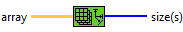
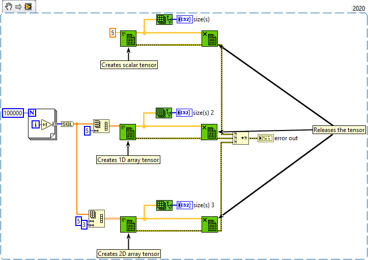

<h1>Array Size</h1>

<h2>Description</h2>

Returns the number of elements in each dimension of n-dimensional array.

<h3>Input parameters</h3>

<table>
  <tbody>
    <tr>
      <td width="64" valign="top"></td>
      <td valign="top"><strong>array : <em>class, </em></strong>n-dimension tensor.</td>
    </tr>
  </tbody>
</table>

<h3>Output parameters</h3>

<table>
  <tbody>
    <tr>
      <td width="64" valign="top"></td>
      <td valign="top"><strong>size(s) : <em>class,</em></strong> returned value is a 1D array in which each element is a 32-bit integer that represents the number of elements in the corresponding dimension of array. The order of elements in the return array corresponds to row-major order. Thus, vol is the first index, followed by page, row, and column. These names are index identifiers and have no other meaning.</td>
    </tr>
  </tbody>
</table>

<h2>Examples</h2>

All these examples are snippets PNG, you can drop these Snippet onto the block diagram and get the depicted code added to your VI (Do not forget to install Accelerator library to run it).

