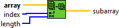
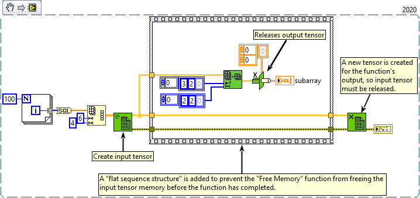

<h1>Array Subset</h1>

<h2>Description</h2>

Returns a portion of array starting at index and containing length elements.

<strong>Warning : A new tensor is created for the output.</strong>

<h3>Input parameters</h3>

<table>
  <tbody>
    <tr>
      <td width="64" valign="top"></td>
      <td valign="top"><strong>array : <em>class,</em></strong> n-dimensional tensor.</td>
    </tr>
    <tr>
      <td width="64" valign="top"></td>
      <td valign="top"><strong>index : <em>array,</em></strong> specifies the first element, row, column, or page to include in the portion of array you want to return. The shape of this entry must be equal to the shape of the array tensor.</td>
    </tr>
    <tr>
      <td width="64" valign="top"></td>
      <td valign="top"><strong>length : <em>array,</em></strong> specifies how many elements, rows, columns, or pages to include in the portion of array you want to return. The shape of this entry must be equal to the shape of the array tensor. The default (-1) is the length from index to the end of array.</td>
    </tr>
  </tbody>
</table>

<h3>Output parameters</h3>

<table>
  <tbody>
    <tr>
      <td width="64" valign="top"></td>
      <td valign="top"><strong>subarray : <em>class,</em></strong> n-dimensional tensor that returns a portion of the input tensor.</td>
    </tr>
  </tbody>
</table>

<h2>Examples</h2>

All these examples are snippets PNG, you can drop these Snippet onto the block diagram and get the depicted code added to your VI (Do not forget to install Accelerator library to run it).

