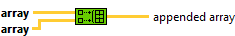
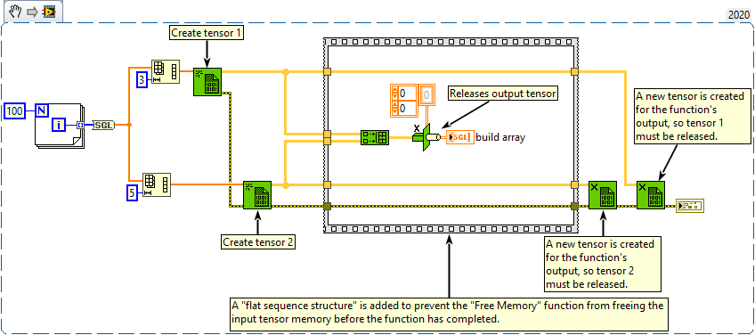

<h1>Build Array</h1>

<h2>Description</h2>

Build arrays to an n-dimensional array.

<strong>Warning : A new tensor is created for the output.</strong>

<h3>Input parameters</h3>

<table>
  <tbody>
    <tr>
      <td width="64" valign="top"></td>
      <td valign="top"><strong>array : <em>class,</em></strong> n-dimensional tensor.</td>
    </tr>
    <tr>
      <td width="64" valign="top"></td>
      <td valign="top"><strong>array : <em>class,</em></strong> n-dimensional tensor.</td>
    </tr>
  </tbody>
</table>

<h3>Output parameters</h3>

<table>
  <tbody>
    <tr>
      <td width="64" valign="top"></td>
      <td valign="top"><strong>appended array : <em>class,</em></strong> the resulting.</td>
    </tr>
  </tbody>
</table>

<h2>Examples</h2>

All these examples are snippets PNG, you can drop these Snippet onto the block diagram and get the depicted code added to your VI (Do not forget to install Accelerator library to run it).

