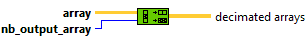
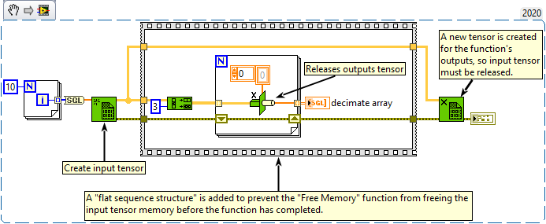

<h1>Decimate 1D Array</h1>

<h2>Description</h2>

Divides the elements of array into the output arrays, placing elements into the outputs successively.

<strong>Warning : A new tensor is created for each element in the output array.</strong>

<h3>Input parameters</h3>

<table>
  <tbody>
    <tr>
      <td width="64" valign="top"></td>
      <td valign="top"><strong>array : <em>class,</em></strong> one-dimentional tensor.</td>
    </tr>
    <tr>
      <td width="64" valign="top"></td>
      <td valign="top"><strong>nb_output_array : <em>integer,</em></strong> number of output arrays.</td>
    </tr>
  </tbody>
</table>

<h3>Output parameters</h3>

<table>
  <tbody>
    <tr>
      <td width="64" valign="top"></td>
      <td valign="top"><strong>decimated arrays : <em>array,</em></strong> the function stores array[0] at index 0 of the first output array, array[1] is stored at index 0 of the second output array, array[n-1] at index 0 of the last output array, array[n] at index 1 of the first output array, and so on, where n is the number of output terminals for this function.</td>
    </tr>
  </tbody>
</table>

<h2>Examples</h2>

All these examples are snippets PNG, you can drop these Snippet onto the block diagram and get the depicted code added to your VI (Do not forget to install Accelerator library to run it).

