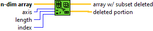
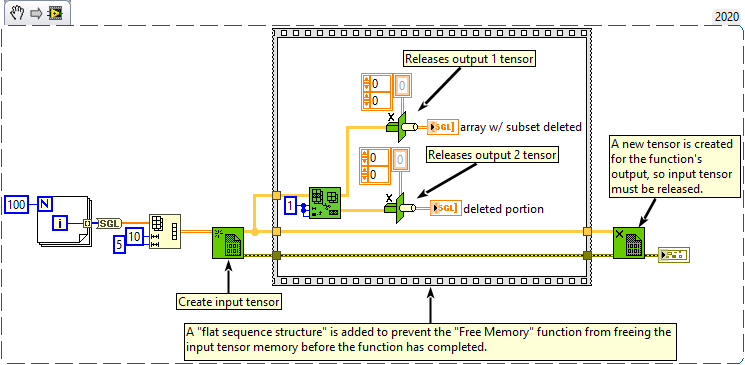

<h1>Delete From Array</h1>

<h2>Description</h2>

Deletes an element or subarray from n-dimensional array of length elements starting at index. Returns the edited array in array w/ subset deleted and the deleted element or subarray in deleted portion.

<strong>Warning : Two new tensors is created for the outputs.</strong>

<h3>Input parameters</h3>

<table>
  <tbody>
    <tr>
      <td width="64" valign="top"></td>
      <td valign="top"><strong>n-dim array : <em>class,</em></strong> n-dimensional tensor from which you want to delete element(s), row(s), column(s), page(s), and so on.</td>
    </tr>
    <tr>
      <td width="64" valign="top"></td>
      <td valign="top"><strong>axis : <em>integer,</em></strong> specifies axis what you want to delete from the array, such as an element, row, column, or page.</td>
    </tr>
    <tr>
      <td width="64" valign="top"></td>
      <td valign="top"><strong>lenght : <em>integer,</em></strong> determines how many elements, rows, columns, or pages to delete. The default length is one element.</td>
    </tr>
    <tr>
      <td width="64" valign="top"></td>
      <td valign="top"><strong>index : <em>integer,</em></strong> specifies index what you want to delete from the array, such as an element, row, column, or page.</td>
    </tr>
  </tbody>
</table>

<h3>Output parameters</h3>

<table>
  <tbody>
    <tr>
      <td width="64" valign="top"></td>
      <td valign="top"><strong>array w/ subset deleted : <em>class,</em></strong> n-dimensional tensor returned with the deleted element(s), row(s), column(s), or page(s).</td>
    </tr>
    <tr>
      <td width="64" valign="top"></td>
      <td valign="top"><strong>deleted portion : <em>class,</em></strong> deleted n-dimensional tensor.</td>
    </tr>
  </tbody>
</table>

<h2>Examples</h2>

All these examples are snippets PNG, you can drop these Snippet onto the block diagram and get the depicted code added to your VI (Do not forget to install Accelerator library to run it).

