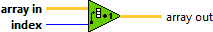
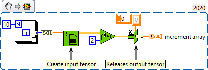

<h1>Increment Array Element</h1>

<h2>Description</h2>

Adds 1 to the specified elements of a n-dimentional array.

<h3>Input parameters</h3>

<table>
  <tbody>
    <tr>
      <td width="64" valign="top"></td>
      <td valign="top"><strong>array in : <em>class,</em></strong> n-dimentional tensor.</td>
    </tr>
    <tr>
      <td width="64" valign="top"></td>
      <td valign="top"><strong>index : <em>integer,</em></strong> specifies the index of the element in the array that you want to increment.</td>
    </tr>
  </tbody>
</table>

<h3>Output parameters</h3>

<table>
  <tbody>
    <tr>
      <td width="64" valign="top"></td>
      <td valign="top"><strong>array out : <em>class,</em></strong> returns the n-dimentional tensor with the specified element incremented.</td>
    </tr>
  </tbody>
</table>

<h2>Examples</h2>

All these examples are snippets PNG, you can drop these Snippet onto the block diagram and get the depicted code added to your VI (Do not forget to install Accelerator library to run it).

