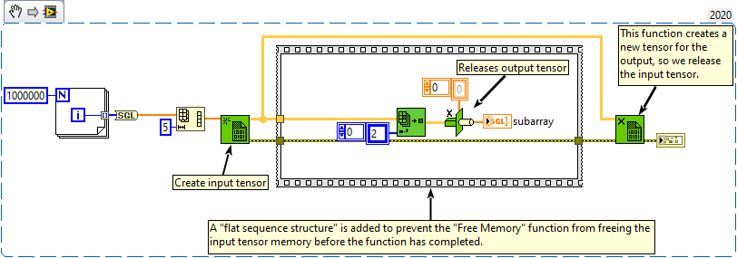
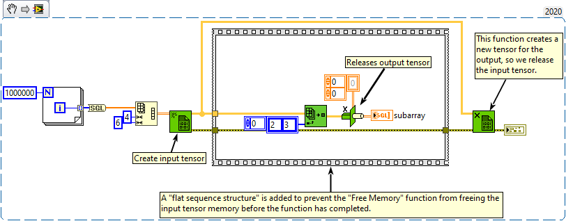
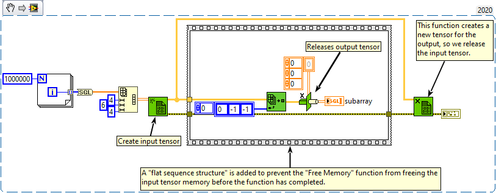

<h1>Index Array</h1>

<h2>Description</h2>

Returns the element or subarray of n-dimensional array at index.

<strong>Warning : A new tensor is created for the output.</strong>

<h3>Input parameters</h3>

<table>
  <tbody>
    <tr>
      <td width="64" valign="top"></td>
      <td valign="top"><strong>array : <em>class, </em></strong>n-dimensional tensor.</td>
    </tr>
    <tr>
      <td width="64" valign="top"></td>
      <td valign="top"><strong>index : <em>array,</em></strong> specifies a number that refers to a location within the input array. If you leave the index input unwired for a ND array, the Index Array function returns all elements of the array. If the index is equal to -1, this index is used to retrieve an array subnet rather than a single element. For example, to retrieve column 1 from a 2D array, the index must be equal to [-1, 1].</td>
    </tr>
  </tbody>
</table>

<h3>Output parameters</h3>

<table>
  <tbody>
    <tr>
      <td width="64" valign="top"></td>
      <td valign="top"><strong>subarray : <em>class,</em></strong> n-dimensional tensor indexed.</td>
    </tr>
  </tbody>
</table>

<h2>Examples</h2>

All these examples are snippets PNG, you can drop these Snippet onto the block diagram and get the depicted code added to your VI (Do not forget to install Accelerator library to run it).

<h3>Index 1D Array</h3>

<h3>Index 2D Array</h3>

<h3>Index 3D Array</h3>

