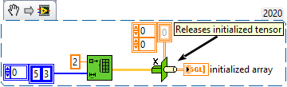

<h1>Initialize Array</h1>

<h2>Description</h2>

Creates a n-dimensional tensor in which every element is initialized to the value of element. Type : <em><strong>polymorphic.</strong></em>

<h3>Input parameters</h3>

<table>
  <tbody>
    <tr>
      <td width="64" valign="top"></td>
      <td valign="top"><strong>element : <em>float,</em></strong> value used to initialize all elements of initialized tensor.</td>
    </tr>
    <tr>
      <td width="64" valign="top"></td>
      <td valign="top"><strong>shape : <em>array,</em></strong> the size of dimensions 0..n-1.</td>
    </tr>
  </tbody>
</table>

<h3>Output parameters</h3>

<table>
  <tbody>
    <tr>
      <td width="64" valign="top"></td>
      <td valign="top"><strong>initialized array : <em>class,</em></strong> tensor of the same type as the type you wire to element.</td>
    </tr>
  </tbody>
</table>

<h2>Examples</h2>

All these examples are snippets PNG, you can drop these Snippet onto the block diagram and get the depicted code added to your VI (Do not forget to install Accelerator library to run it).

