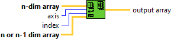
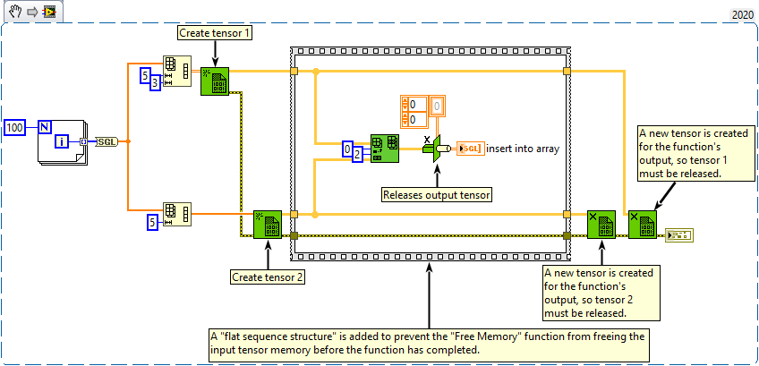

<h1>Insert Into Array</h1>

<h2>Description</h2>

Inserts an subarray into n-dimensional array at the point you specify in index and axis.

<strong>Warning : A new tensor is created for the output.</strong>

<h3>Input parameters</h3>

<table>
  <tbody>
    <tr>
      <td width="64" valign="top"></td>
      <td valign="top"><strong>n-dim array : <em>class,</em></strong> n-dimensional tensor in which you want to insert an element, row, column, page, and so on.</td>
    </tr>
    <tr>
      <td width="64" valign="top"></td>
      <td valign="top"><strong>axis : <em>integer,</em></strong> specifies the axis in the array at which you want to insert the element, row, column, page, and so on.</td>
    </tr>
    <tr>
      <td width="64" valign="top"></td>
      <td valign="top"><strong>index : <em>integer,</em></strong> specifies the index in the array at which you want to insert the element, row, column, page, and so on.</td>
    </tr>
    <tr>
      <td width="64" valign="top"></td>
      <td valign="top"><strong>n or n-1 dim array : <em>class, </em></strong>element, row, column, or page you want to insert into the tensor specified in “<strong>n-dim array”</strong>.</td>
    </tr>
  </tbody>
</table>

<h3>Output parameters</h3>

<table>
  <tbody>
    <tr>
      <td width="64" valign="top"></td>
      <td valign="top"><strong>output array : <em>class,</em></strong> is the tensor this function returns with the inserted element(s), row(s), column(s), or page(s).</td>
    </tr>
  </tbody>
</table>

<h2>Examples</h2>

All these examples are snippets PNG, you can drop these Snippet onto the block diagram and get the depicted code added to your VI (Do not forget to install Accelerator library to run it).

