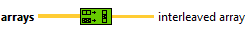
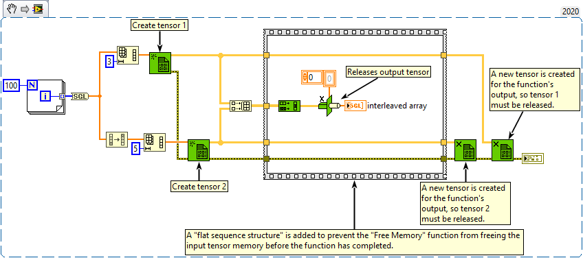

<h1>Interleave 1D Array</h1>

<h2>Description</h2>

Interleaves corresponding elements from the input arrays into a single output array.

<strong>Warning : A new tensor is created for the output.</strong>

<h3>Input parameters</h3>

<table>
  <tbody>
    <tr>
      <td width="64" valign="top"></td>
      <td valign="top"><strong>arrays : <em>array,</em></strong> array of one-dimentional tensor.</td>
    </tr>
  </tbody>
</table>

<h3>Output parameters</h3>

<table>
  <tbody>
    <tr>
      <td width="64" valign="top"></td>
      <td valign="top"><strong>interleaved array : <em>class,</em></strong> interleaved array[0] contains array 0[0], interleaved array[1] contains array 1[0], interleaved array[n-1] contains array n-1[0], interleaved array[n] contains array 0[1], and so on, where n is the number of input terminals.</td>
    </tr>
  </tbody>
</table>

<h2>Examples</h2>

All these examples are snippets PNG, you can drop these Snippet onto the block diagram and get the depicted code added to your VI (Do not forget to install Accelerator library to run it).

