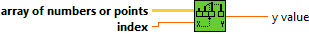
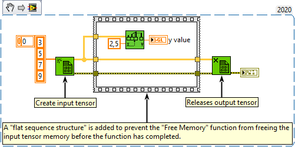

<h1>Interpolate 1D Array</h1>

<h2>Description</h2>

Linearly interpolates a decimal y value from an array of numbers or points using a fractional index or x value.

<h3>Input parameters</h3>

<table>
  <tbody>
    <tr>
      <td width="64" valign="top"></td>
      <td valign="top"><strong>array of numbers or points : <em>class,</em></strong> a one-dimentional tensor of numbers or a tensor of points where each point is a cluster of x and y coordinates. If this input is a tensor of points, the function uses the first element in the cluster (x) to obtain a fractional index by linear interpolation. The function then uses this fractional index to compute the output y value from the second cluster element (y).</td>
    </tr>
    <tr>
      <td width="64" valign="top"></td>
      <td valign="top"><strong>index : <em>float,</em></strong> index or x-value at which the function should return a y-value. For example, if array of numbers or points contains two double-precision, floating-point numeric values, 5 and 7, and fractional index or x is set to 0.5, the function returns 6.0, which is halfway between the values at elements 0 and 1.</td>
    </tr>
  </tbody>
</table>

<h3>Output parameters</h3>

<table>
  <tbody>
    <tr>
      <td width="64" valign="top"></td>
      <td valign="top"><strong>y value : <em>float,</em></strong> interpolated value of the element at the fractional index or the interpolated y-value of the fractional data point, in tensor of numbers or points.</td>
    </tr>
  </tbody>
</table>

<h2>Examples</h2>

All these examples are snippets PNG, you can drop these Snippet onto the block diagram and get the depicted code added to your VI (Do not forget to install Accelerator library to run it).

