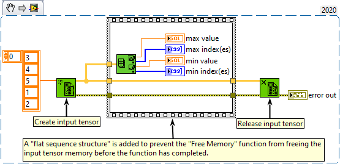

<h1>Min & Max</h1>

<h2>Description</h2>

Returns the maximum and minimum values found in array, along with the indexes for each value. Type : <em><strong>Polyporphic.</strong></em> 

<h3>Input parameters</h3>

<table>
  <tbody>
    <tr>
      <td width="64" valign="top"></td>
      <td valign="top"><strong>array : <em>class,</em></strong> n-dimensional tensor.</td>
    </tr>
  </tbody>
</table>

<h3>Output parameters</h3>

<table>
  <tbody>
    <tr>
      <td width="64" valign="top"></td>
      <td valign="top"><strong>max value : <em>float,</em></strong> is of the same data type and structure as the elements in array.</td>
    </tr>
    <tr>
      <td width="64" valign="top"></td>
      <td valign="top"><strong>max index(es) : <em>array,</em></strong> index for the first max value. If array is multidimensional, max index(es) is an array whose elements are the indexes for the first maximum value in array.</td>
    </tr>
    <tr>
      <td width="64" valign="top"></td>
      <td valign="top"><strong>min value : <em>float,</em></strong> is of the same data type and structure as the elements in array.</td>
    </tr>
    <tr>
      <td width="64" valign="top"></td>
      <td valign="top"><strong>min index(es) : <em>array,</em></strong> index for the first max value. If array is multidimensional, max index(es) is an array whose elements are the indexes for the first minimum value in array.</td>
    </tr>
  </tbody>
</table>

<h2>Examples</h2>

All these examples are snippets PNG, you can drop these Snippet onto the block diagram and get the depicted code added to your VI (Do not forget to install Accelerator library to run it).

