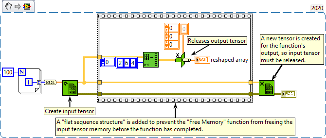

<h1>Reshape Array</h1>

<h2>Description</h2>

Changes the dimensions of an array according to the values of dimension size 0..m-1.

<strong>Warning : A new tensor is created for the output.</strong>

<h3>Input parameters</h3>

<table>
  <tbody>
    <tr>
      <td width="64" valign="top"></td>
      <td valign="top"><strong>n-dim array : <em>class,</em></strong> n-dimensional tensor.</td>
    </tr>
    <tr>
      <td width="64" valign="top"></td>
      <td valign="top"><strong>dimension_size : <em>array,</em></strong> specifies the dimensions of m-dim array.</td>
    </tr>
  </tbody>
</table>

<h3>Output parameters</h3>

<table>
  <tbody>
    <tr>
      <td width="64" valign="top"></td>
      <td valign="top"><strong>m-dim array : <em>class,</em></strong> if the product of the dimension sizes is greater than the number of elements in the input array, the function pads the new array with the default of the data type of n-dim array. If the product of the dimension sizes is less than the number of elements in the input array, the function truncates the array.</td>
    </tr>
  </tbody>
</table>

<h2>Examples</h2>

All these examples are snippets PNG, you can drop these Snippet onto the block diagram and get the depicted code added to your VI (Do not forget to install Accelerator library to run it).

