<h1>Array Resume</h1>

<table>
  <tbody>
    <tr>
      <td valign="top" width="50%">
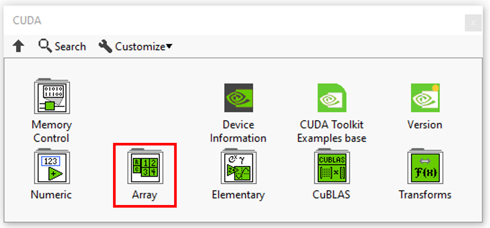
</td>
      <td valign="top" width="50%">
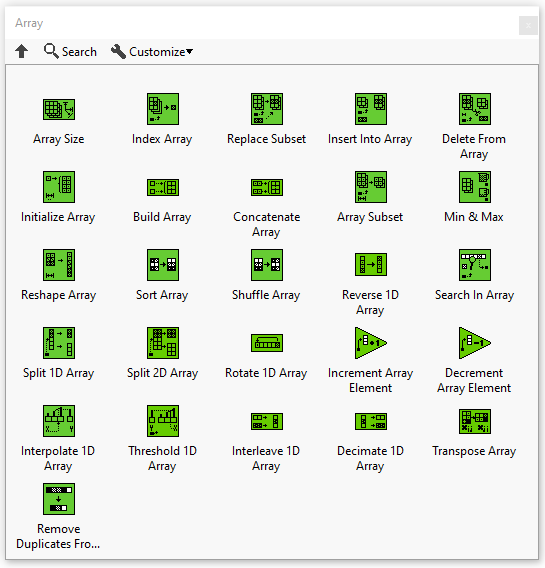
</td>
    </tr>
  </tbody>
</table>

In this section you’ll find a list of all array fonctionalities.

|  | **ICONS** | **DESCRIPTION** |
| --- | --- | --- |
| [Array Size](../array-size/README.md) |  | Returns the number of elements in each dimension of n-dimensional array. |
| [Index Array](../index-array/README.md) | 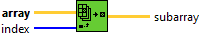 | Returns the element or subarray of n-dimensional array at index. |
| [Replace Subset](../replace-subset/README.md) | 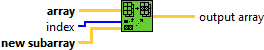 | Replaces an element or subarray in a n-dimensional array at the point you specify in index. |
| [Insert Into Array](../insert-into-array/README.md) |  | Inserts an subarray into n-dimensional array at the point you specify in index and axis. |
| [Delete From Array](../delete-from-array/README.md) |  | Deletes an element or subarray from n-dimensional array of length elements starting at index. |
| [Initialize Array](../initialize-array/README.md) | 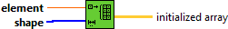 | Creates a n-dimensional tensor in which every element is initialized to the value of element. |
| [Buid Array](../../../_unmigrated/perrine-graiphic-io/buid-array/README.md) |  | Build arrays to an n-dimensional array. |
| [Concatenate Array](../concatenate-array/README.md) | 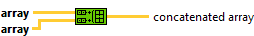 | Concatenate arrays to an n-dimensional array. |
| [Array Subset](../array-subset/README.md) |  | Returns a portion of array starting at index and containing length elements. |
| [Min & Max](../min-max/README.md) | 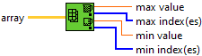 | Returns the maximum and minimum values found in array, along with the indexes for each value. |
| [Reshape Array](../reshape-array/README.md) | 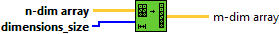 | Changes the dimensions of an array according to the values of dimension size 0..m-1. |
| [Sort Array](../../../_unmigrated/perrine-graiphic-io/sort-array/README.md) | 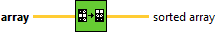 | Rearranges array by sorting the elements in ascending order. |
| [Shuffle Array](../shuffle-array/README.md) | 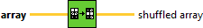 | Rearranges the elements of an array in a pseudorandom order. |
| [Reverse 1D Array](../reverse-1d-array/README.md) |  | Reverses the order of the elements in array, where array is of any type. |
| [Search In Array](../search-in-array/README.md) | 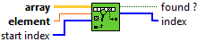 | Searches for an element in an array starting at start index. |
| [Split 1D Array](../split-1d-array/README.md) | 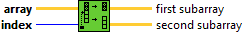 | Divides array at index and returns the two portions with the element of index at the beginning of second subarray. |
| [Split 2D Array](../split-2d-array/README.md) | 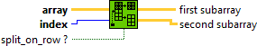 | Divides array at index and returns the two portions with the element of index at the beginning of second subarray. |
| [Rotate 1D Array](../rotate-1d-array/README.md) | 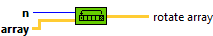 | Rotates the elements of array the number of places and in the direction indicated by n. |
| [Increment Array Element](../increment-array-element/README.md) |  | Adds 1 to the specified elements of a n-dimentional array. |
| [Decrement Array Element](../decrement-array-element/README.md) | 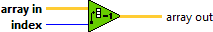 | Subtracts 1 from the specified element of a n-dimentional array. |
| [Interpolate 1D Array](../interpolate-1d-array/README.md) |  | Linearly interpolates a decimal y value from an array of numbers or points using a fractional index or x value. |
| [Threshold 1D Array](../threshold-1d-array/README.md) | 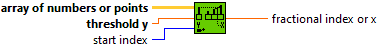 | Interpolates points in a one-dimentional array that represents a two-dimentional non-descending graph. |
| [Interleave 1D Array](../interleave-1d-array/README.md) |  | Interleaves corresponding elements from the input arrays into a single output array. |
| [Decimate 1D Array](../decimate-1d-array/README.md) |  | Divides the elements of array into the output arrays, placing elements into the outputs successively. |
| [Transpose Array](../transpose-array/README.md) | 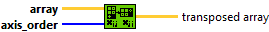 | Rearranges the elements of n-dimensional array such that array becomes transposed array. |
| [Remove Duplicates From 1D Array](../remove-duplicates-from-1d-array/README.md) | 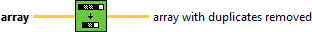 | Removes duplicate elements from a one-dimentional array. |
