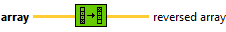
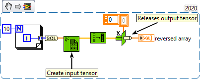

<h1>Reverse 1D Array</h1>

<h2>Description</h2>

Reverses the order of the elements in array, where array is of any type.

<h3>Input parameters</h3>

<table>
  <tbody>
    <tr>
      <td width="64" valign="top"></td>
      <td valign="top"><strong>array : <em>class,</em></strong> one-dimentional tensor of any type.</td>
    </tr>
  </tbody>
</table>

<h3>Output parameters</h3>

<table>
  <tbody>
    <tr>
      <td width="64" valign="top"></td>
      <td valign="top"><strong>reversed array : <em>class,</em></strong> if tensor has n elements, array[0] becomes reversed array[n-1], array[1] becomes reversed array[n-2], and so on.</td>
    </tr>
  </tbody>
</table>

<h2>Examples</h2>

All these examples are snippets PNG, you can drop these Snippet onto the block diagram and get the depicted code added to your VI (Do not forget to install Accelerator library to run it).

