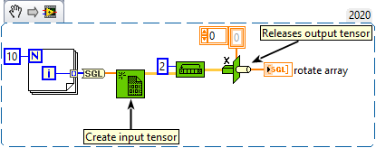

<h1>Rotate 1D Array</h1>

<h2>Description</h2>

Rotates the elements of array the number of places and in the direction indicated by n.

<h3>Input parameters</h3>

<table>
  <tbody>
    <tr>
      <td width="64" valign="top"></td>
      <td valign="top"><strong>array : <em>class,</em></strong> one-dimentional tensor.</td>
    </tr>
    <tr>
      <td width="64" valign="top"></td>
      <td valign="top"><strong>n : <em>integer,</em></strong> must be a numeric data type. The function coerces n to a 32-bit integer if you wire another representation to it.</td>
    </tr>
  </tbody>
</table>

<h3>Output parameters</h3>

<table>
  <tbody>
    <tr>
      <td width="64" valign="top"></td>
      <td valign="top"><strong>rotate array : <em>class,</em></strong> is the output array. For example, if n is 1, the input array[0] becomes output array[1], input array[1] becomes output array[2], and so on, and input array[m–1] becomes output array[0], where m is the number of elements in the array. If n is –2, input array[0] becomes output array[m–2], input array[1] becomes output array[m–1], and so on, and input array[m–1] becomes output array[m–3], where m is the number of elements in the array.</td>
    </tr>
  </tbody>
</table>

<h2>Examples</h2>

All these examples are snippets PNG, you can drop these Snippet onto the block diagram and get the depicted code added to your VI (Do not forget to install Accelerator library to run it).

