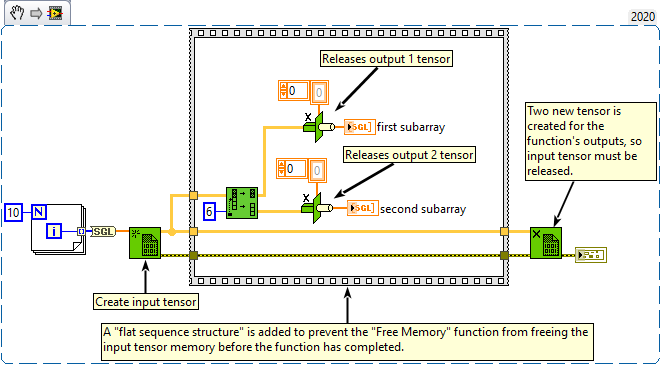

<h1>Split 1D Array</h1>

<h2>Description</h2>

Divides array at index and returns the two portions with the element of index at the beginning of second subarray.

<strong>Warning : Two new tensors is created for the outputs.</strong>

<h3>Input parameters</h3>

<table>
  <tbody>
    <tr>
      <td width="64" valign="top"></td>
      <td valign="top"><strong>array : <em>class,</em></strong> one-dimentional tensor.</td>
    </tr>
    <tr>
      <td width="64" valign="top"></td>
      <td valign="top"><strong>index : <em>integer,</em></strong> if index is negative or 0, first subarray is empty. If index is equal to or greater than the size of array, second subarray is empty.</td>
    </tr>
  </tbody>
</table>

<h3>Output parameters</h3>

<table>
  <tbody>
    <tr>
      <td width="64" valign="top"></td>
      <td valign="top"><strong>first subarray : <em>class,</em></strong> contains array[0] through array[index-1].</td>
    </tr>
    <tr>
      <td width="64" valign="top"></td>
      <td valign="top"><strong>second subarray : <em>class,</em></strong> contains the remaining array elements not already contained in first subarray.</td>
    </tr>
  </tbody>
</table>

<h2>Examples</h2>

All these examples are snippets PNG, you can drop these Snippet onto the block diagram and get the depicted code added to your VI (Do not forget to install Accelerator library to run it).

