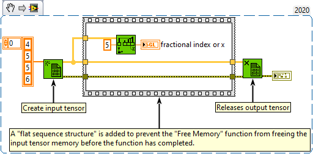

<h1>Threshold 1D Array</h1>

<h2>Description</h2>

Interpolates points in a one-dimentional array that represents a two-dimentional non-descending graph. This function compares threshold y to the values in array of numbers or points starting at start index until it finds a pair of consecutive elements such that threshold y is greater than or equal to the value of the first element and less than or equal to the value of the second element.

<h3>Input parameters</h3>

<table>
  <tbody>
    <tr>
      <td width="64" valign="top"></td>
      <td valign="top"><strong>array of numbers or points : <em>class,</em></strong> a one-dimentional tensor of numbers or a tensor of points where each point is a cluster of x- and y-coordinates. If this input is an tensor of points, this function uses the second elements in the clusters, or the y-coordinates, to obtain a fractional index that it then uses to interpolate the corresponding x value.</td>
    </tr>
    <tr>
      <td width="64" valign="top"></td>
      <td valign="top"><strong>threshold y : <em>float,</em></strong> threshold value for the function. If threshold y is less than or equal to the array value at start index, the function returns start index for fractional index or x. If threshold y is greater than every value in the array, the function returns the index of the last value.</td>
    </tr>
    <tr>
      <td width="64" valign="top"></td>
      <td valign="top"><strong>start index : <em>integer,</em></strong> must be a number. The default is 0, which means the function returns the result calculated from the entire array, rather than a specified section of the array.</td>
    </tr>
  </tbody>
</table>

<h3>Output parameters</h3>

<table>
  <tbody>
    <tr>
      <td width="64" valign="top"></td>
      <td valign="top"><strong>fractional index or x : <em>float,</em></strong> interpolated result function calculates for the array of numbers or points one-dimentional input tensor.</td>
    </tr>
  </tbody>
</table>

<h2>Examples</h2>

All these examples are snippets PNG, you can drop these Snippet onto the block diagram and get the depicted code added to your VI (Do not forget to install Accelerator library to run it).

