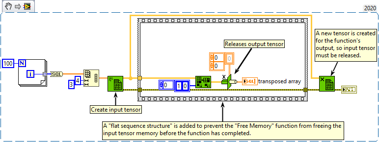
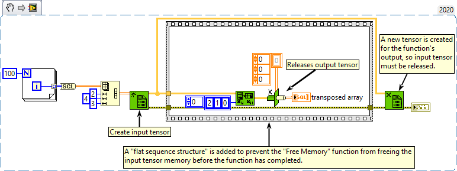
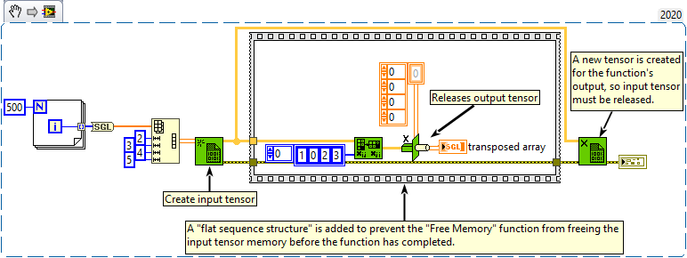

<h1>Transpose Array</h1>

<h2>Description</h2>

Rearranges the elements of n-dimensional array such that array becomes transposed array.

<strong>Warning : A new tensor is created for the output.</strong>

<h3>Input parameters</h3>

<table>
  <tbody>
    <tr>
      <td width="64" valign="top"></td>
      <td valign="top"><strong>array : <em>class,</em></strong> n-dimentional tensor.</td>
    </tr>
    <tr>
      <td width="64" valign="top"></td>
      <td valign="top"><strong>axis_order : <em>array,</em></strong> order of the axes that define the transposition.</td>
    </tr>
  </tbody>
</table>

<h3>Output parameters</h3>

<table>
  <tbody>
    <tr>
      <td width="64" valign="top"></td>
      <td valign="top"><strong>transposed array : <em>class,</em></strong> the result.</td>
    </tr>
  </tbody>
</table>

<h2>Examples</h2>

All these examples are snippets PNG, you can drop these Snippet onto the block diagram and get the depicted code added to your VI (Do not forget to install Accelerator library to run it).

<h3>Transpose 2D Array</h3>

<h3>Transpose 3D Array</h3>

<h3>Transpose 4D Array</h3>

