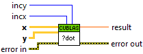
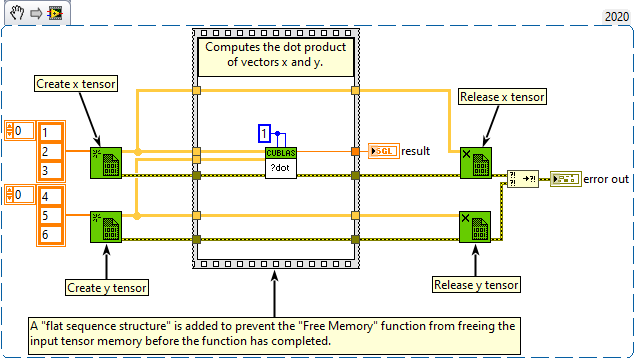

<h1>dot</h1>

<h2>Description</h2>

This function computes the dot product of vectors x and y. Type : <em><strong>polymorphic</strong><strong>.</strong></em>

<h3>Input parameters</h3>

<table>
  <tbody>
    <tr>
      <td width="64" valign="top"></td>
      <td valign="top"><strong>x : <em>class, </em></strong>tensor of a vector with n elements.</td>
    </tr>
    <tr>
      <td width="64" valign="top"></td>
      <td valign="top"><strong>y : <em>class, </em></strong>tensor of a vector with n elements.</td>
    </tr>
    <tr>
      <td width="64" valign="top"></td>
      <td valign="top"><strong>incx : <em>integer,</em></strong> stride between consecutive elements of x.</td>
    </tr>
    <tr>
      <td width="64" valign="top"></td>
      <td valign="top"><strong>incy : <em>integer,</em></strong> stride between consecutive elements of y.</td>
    </tr>
  </tbody>
</table>

<h3>Output parameters</h3>

<table>
  <tbody>
    <tr>
      <td width="64" valign="top"></td>
      <td valign="top"><strong>result : <em>float,</em></strong> the resulting dot product, which is 0.0 if number of elements in the vectors x and y is <= 0.</td>
    </tr>
  </tbody>
</table>

<h2>Examples</h2>

All these examples are snippets PNG, you can drop these Snippet onto the block diagram and get the depicted code added to your VI (Do not forget to install Accelerator library to run it).

