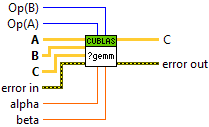
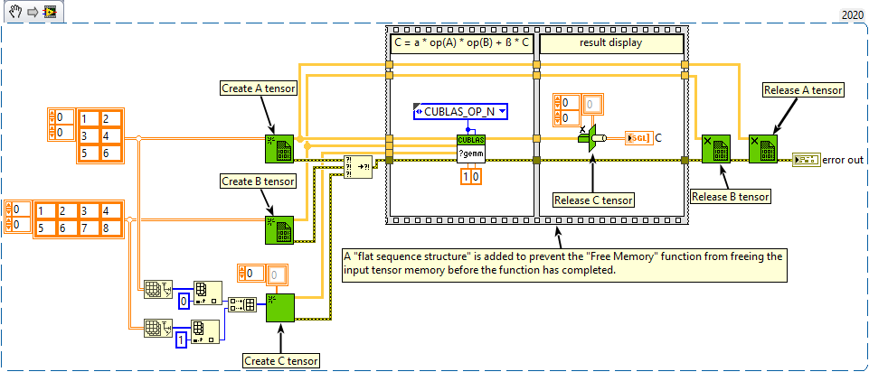
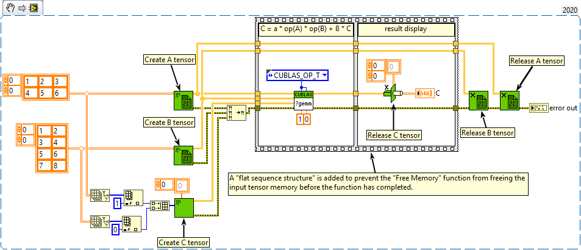
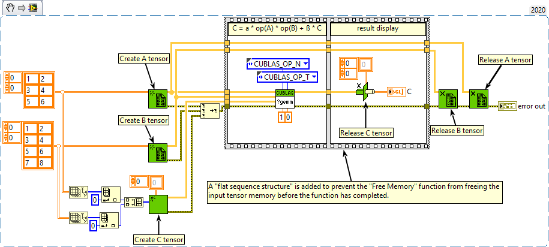
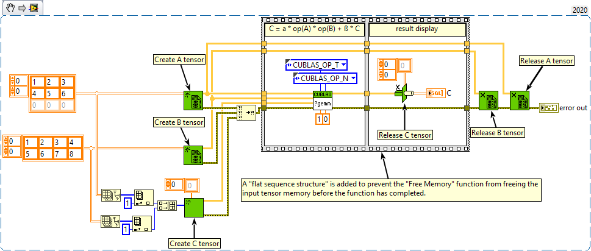

<h1>gemm</h1>

<h2>Description</h2>

This function performs the matrix-matrix multiplication : C = α * op(A) * op(B) + β * C Type : <em><strong>polymorphic</strong><strong>.</strong></em>

<h3>Input parameters</h3>

<table>
  <tbody>
    <tr>
      <td width="64" valign="top"></td>
      <td valign="top"><strong>A : <em>class, </em></strong>2D tensor of dimension M x K.</td>
    </tr>
    <tr>
      <td width="64" valign="top"></td>
      <td valign="top"><strong>B : <em>class, </em></strong>2D tensor of dimension K x N.</td>
    </tr>
    <tr>
      <td width="64" valign="top"></td>
      <td valign="top"><strong>C : <em>class, </em></strong>2D tensor of dimension M x N.</td>
    </tr>
    <tr>
      <td width="64" valign="top"></td>
      <td valign="top"><strong>Op(A) : <em>enum,</em></strong> operation that is non- or transpose.
<ul>
<li>
<ul>
<li>CUBLAS_OP_N : the non-transpose operation is selected</li>
<li>CUBLAS_OP_T : the transpose operation is selected</li>
<li>CUBLAS_OP_H : the conjugate transpose operation is selected</li>
</ul>
</li>
</ul></td>
    </tr>
    <tr>
      <td width="64" valign="top"></td>
      <td valign="top"><strong>Op(B) : <em>enum,</em></strong> operation that is non- or transpose.
<ul>
<li>
<ul>
<li>CUBLAS_OP_N : the non-transpose operation is selected</li>
<li>CUBLAS_OP_T : the transpose operation is selected</li>
<li>CUBLAS_OP_H : the conjugate transpose operation is selected</li>
</ul>
</li>
</ul></td>
    </tr>
    <tr>
      <td width="64" valign="top"></td>
      <td valign="top"><strong>α : <em>float,</em></strong> scalar used for multiplication.</td>
    </tr>
    <tr>
      <td width="64" valign="top"></td>
      <td valign="top"><strong>β : <em>float,</em></strong> scalar used for multiplication, if beta==0 then C does not have to be a valid input.</td>
    </tr>
  </tbody>
</table>

<h3>Output parameters</h3>

<table>
  <tbody>
    <tr>
      <td width="64" valign="top"></td>
      <td valign="top"><strong>C : <em>class, </em></strong>2D tensor of dimension M x N.</td>
    </tr>
  </tbody>
</table>

<h2>Examples</h2>

All these examples are snippets PNG, you can drop these Snippet onto the block diagram and get the depicted code added to your VI (Do not forget to install Accelerator library to run it).

<h3>The non-transposed operation is selected for A and B</h3>

<h3>The transposed operation is selected for A and B</h3>

<h3>The transposed operation is selected for B</h3>

<h3>The transposed operation is selected for A</h3>

