<h1>Exponential Resume</h1>

<table>
  <tbody>
    <tr>
      <td valign="top" width="25%">

</td>
      <td valign="top" width="25%">
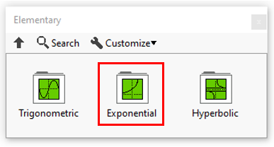
</td>
      <td valign="top" width="50%">
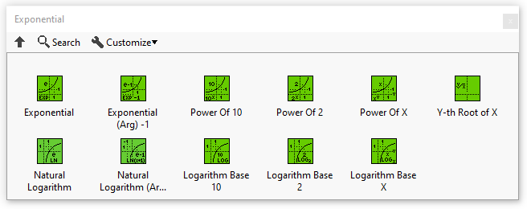
</td>
    </tr>
  </tbody>
</table>

In this section you’ll find a list of all exponential fonctionalities.

|  | **ICONS** | **DESCRIPTION** |
| --- | --- | --- |
| [Exponential](../exponential/README.md) | 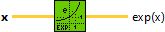 | Computes the value of e raised to the x power, or the exponential of x. |
| [Exponential (Arg) – 1](../exponential-arg-1/README.md) | 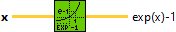 | Computes 1 less than the value of e raised to the x power. |
| [Power Of 10](../power-of-10/README.md) | 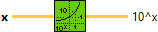 | Computes 10 raised to the x power. |
| [Power Of 2](../power-of-2/README.md) |  | Computes 2 raised to the x power. |
| [Power Of X](../power-of-x/README.md) | 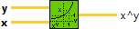 | Computes x raised to the y power. |
| [Y-th Root of X](../y-th-root-of-x/README.md) | 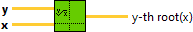 | Returns the yth root of the input value x. |
| [Natural Logarithm](../natural-logarithm/README.md) | 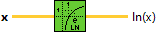 | Computes the base e natural logarithm of x. |
| [Natural Logarithm (Arg + 1)](../natural-logarithm-arg/README.md) |  | Computes the natural logarithm of (x + 1). |
| [Logarithm Base 10](../logarithm-base-2/README.md) | 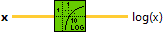 | Computes the base 10 logarithm of x. |
| [Logarithm Base 2](../logarithm-base-2-2/README.md) | 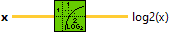 | Computes the base 2 logarithm of x. |
| [Logarithm Base X](../logarithm-base-x/README.md) | 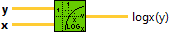 | Computes the base x logarithm of y. |
