<h1>Trigonometric Resume</h1>

<table>
  <tbody>
    <tr>
      <td valign="top" width="25%">
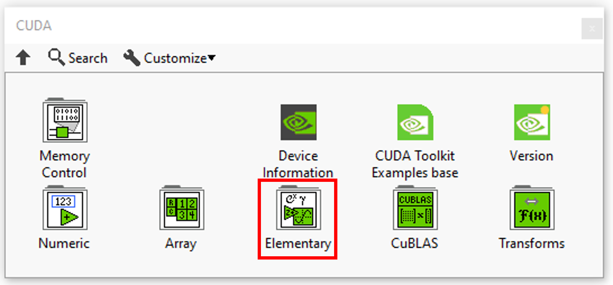
</td>
      <td valign="top" width="25%">
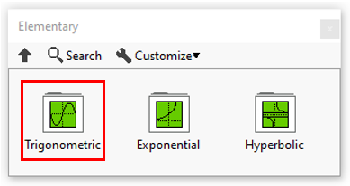
</td>
      <td valign="top" width="50%">
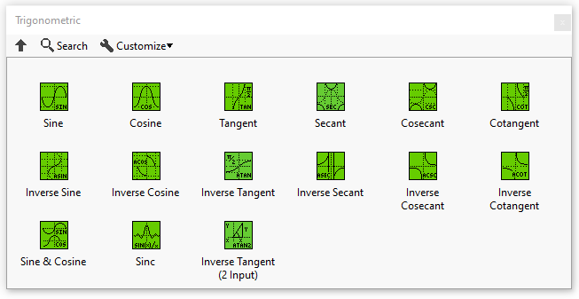
</td>
    </tr>
  </tbody>
</table>

In this section you’ll find a list of all trigonometric fonctionalities.

|  | **ICONS** | **DESCRIPTION** |
| --- | --- | --- |
| [Sine](../sine/README.md) | 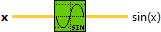 | Computes the sine of x, where x is in radians. |
| [Cosine](../cosine/README.md) | 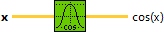 | Computes the cosine of x, where x is in radians. |
| [Tangent](../tangent/README.md) | 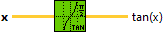 | Computes the tangent of x, where x is in radians. |
| [Secant](../secant/README.md) | 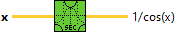 | Computes the secant of x, where x is in radians. |
| [Cosecant](../cosecant/README.md) | 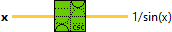 | Computes the cosecant of x, where x is in radians. |
| [Cotangent](../../../../_unmigrated/perrine-graiphic-io/cotangent/README.md) | 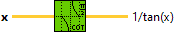 | Computes the cotangent of x, where x is in radians. |
| [Inverse Sine](../inverse-sine/README.md) | 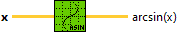 | Computes the arcsine of x. |
| [Inverse Cosine](../inverse-cosine/README.md) | 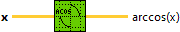 | Computes the arccosine of x. |
| [Inverse Tangent](../inverse-tangent/README.md) | 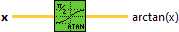 | Computes the arctangent of x. |
| [Inverse Secant](../inverse-secant/README.md) | 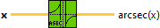 | Computes the inverse secant of x. |
| [Inverse Cosecant](../inverse-cosecant/README.md) | 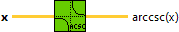 | Computes the inverse cosecant of x. |
| [Inverse Cotangent](../inverse-cotangent/README.md) | 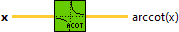 | Computes the inverse cotangent of x. |
| [Sine & Cosine](../sine-cosine/README.md) |  | Computes both the sine and cosine of x, where x is in radians. |
| [Sinc](../sinc/README.md) | 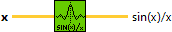 | Computes the sine of x divided by x, where x is in radians. |
| [Inverse Tangent (2 Input)](../inverse-tangent-2/README.md) | 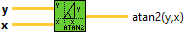 | Computes the arctangent of y/x. |
