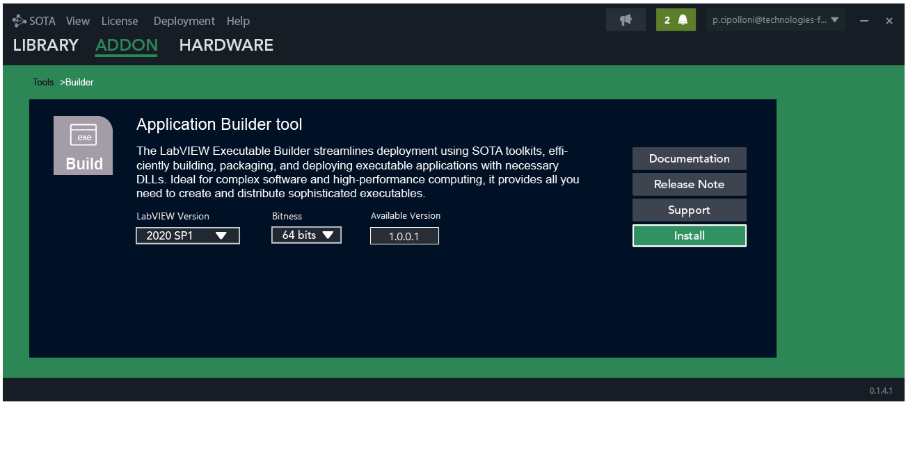
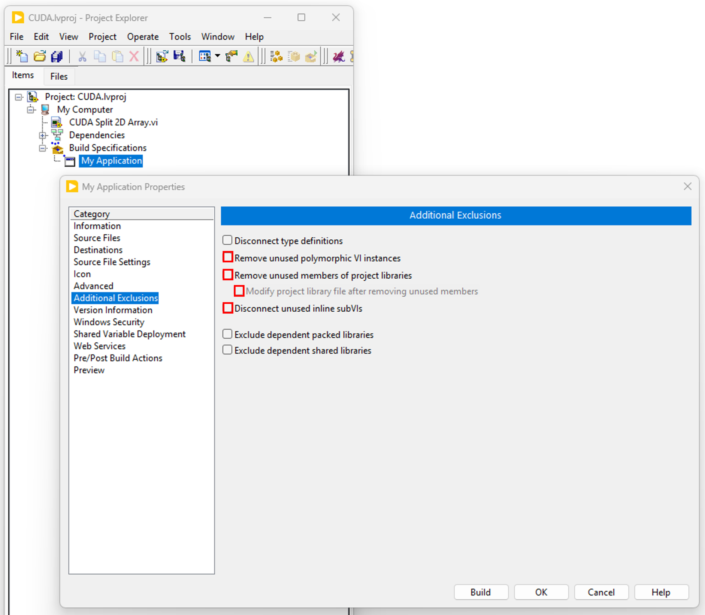
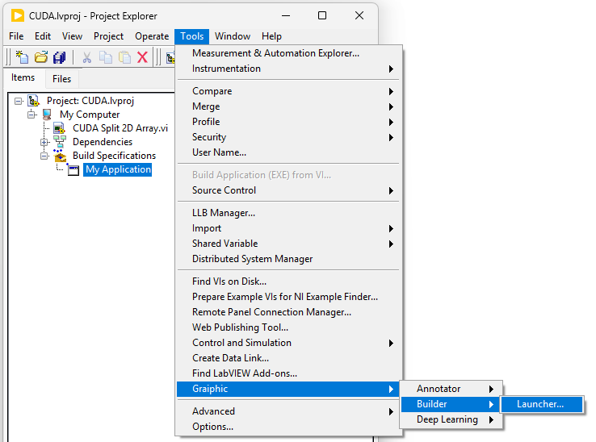
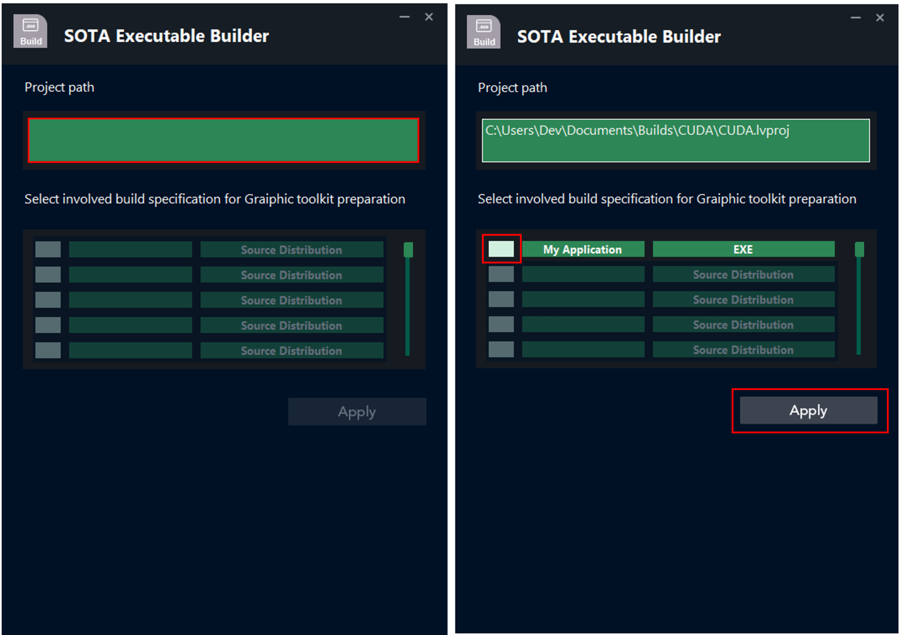
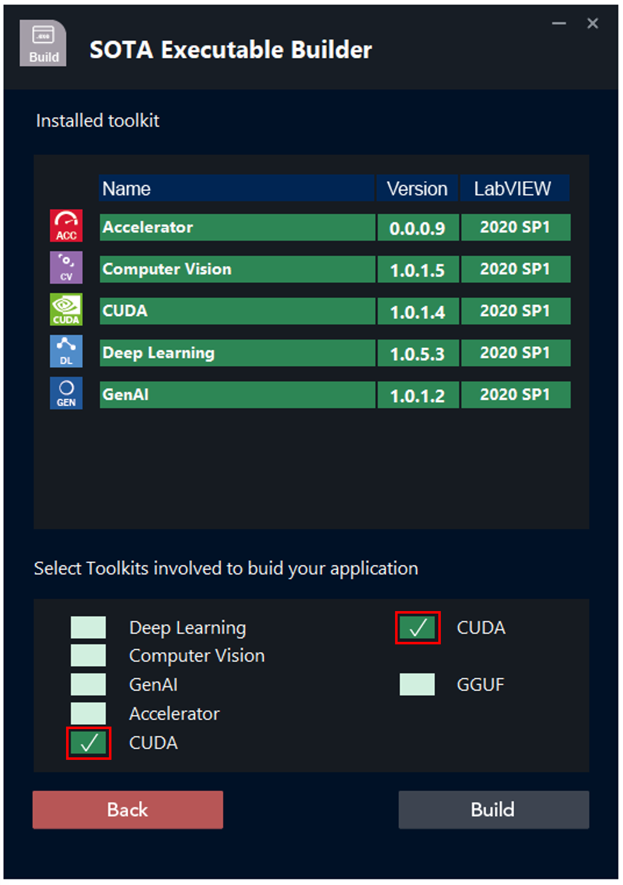
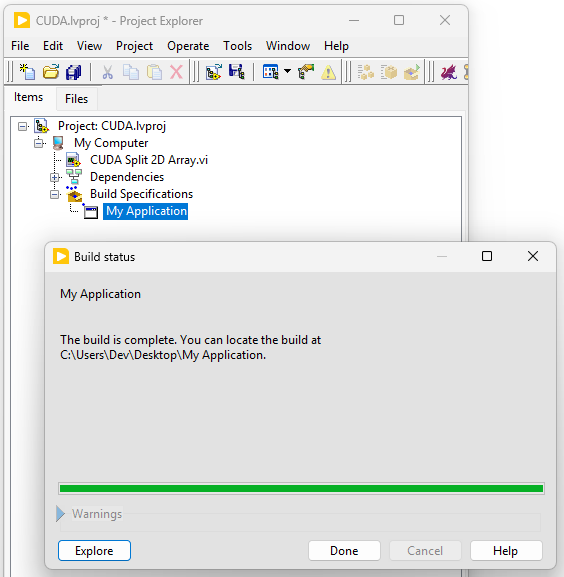

<h1>Building Executables from Graiphic Toolkits</h1>

<h2>How to build an executable ?</h2>

<ul>
<li>
<ul>
<li>Download and open <strong>SOTA</strong>. In the menu, select <strong>Addon</strong>, then click on <strong>Tools</strong> and choose the <strong>Builder</strong> tool. Then download the version of the <strong>Builder</strong> tool compatible with your LabVIEW installation.</li>
</ul>
</li>
</ul>

<ul>
<li>
<ul>
<li>Create your executable and in the “<strong>Additional Exclusions</strong>” tab, uncheck “<strong>Remove unused polymorphic VI instances</strong>“, “<strong>Remove unused members of project libraries</strong>” and “<strong>Disconnect unused inline subVIs</strong>“.</li>
</ul>
</li>
</ul>

<ul>
<li>
<ul>
<li>Once your project has been created and configured, go to the LabVIEW menu, click on <strong>Tools</strong>, then on <strong>Graiphic</strong> and <strong>Builder</strong>, and launch the <strong>Launcher</strong>. A VI will open: it will allow you to manage the build of your executable by including the files required for its operation, depending on the Graiphic toolkits you are using.</li>
</ul>
</li>
</ul>

<ul>
<li>
<ul>
<li>Run the VI and click on the <strong>Project Path</strong> field to select your project path. Once the path is selected, the list of executables you have created will be displayed. All you need to do is select the executable you want to build, and then click <strong>Apply</strong>.</li>
</ul>
</li>
</ul>

<ul>
<li>
<ul>
<li>On the second page, the toolkits installed on your computer are displayed. Simply select the toolkit(s) used in your project, and then click <strong>Build</strong>.</li>
</ul>
</li>
</ul>

<ul>
<li>
<ul>
<li>The build of your LabVIEW executable will start. All you need to do is wait and then click <strong>Done</strong>.</li>
</ul>
</li>
</ul>

