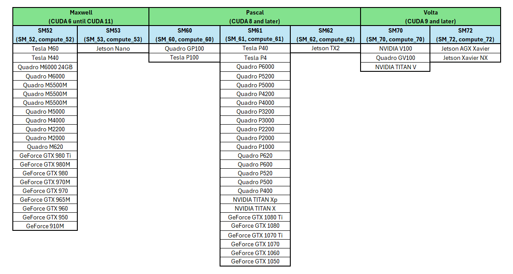
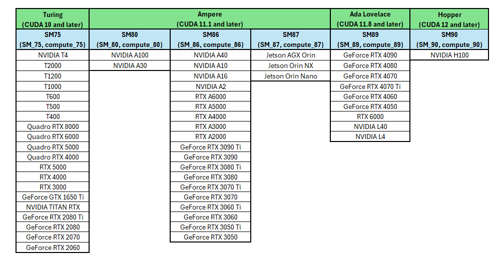

<h1>Hardware Compatibility</h1>

Please find on this page the Hardware compatibility driver table.

<h2>1 – CUDA</h2>

To know which version of cuda is used with your Graiphic toolkits please consult the <a href="https://graiphic.io/support-community/forum/update/releases/">release notes page</a>.

