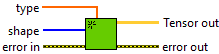

<h1>Create Tensor</h1>

<h2>Description</h2>

Allocates size bytes of linear memory on the device and returns a tensor to the allocated memory. Type : <em><strong>polymorphic</strong><strong>.</strong></em>

<h3>Input parameters</h3>

<table>
  <tbody>
    <tr>
      <td width="64" valign="top"></td>
      <td valign="top"><strong>type : array or <em>float, </em></strong>tensor (can be a scalar, 1D, 2D, 3D, 4D, 5D, 6D array).</td>
    </tr>
    <tr>
      <td width="64" valign="top"></td>
      <td valign="top"><strong>shape : <em>array, </em></strong>tensor shape.</td>
    </tr>
  </tbody>
</table>

<h3>Output parameters</h3>

<table>
  <tbody>
    <tr>
      <td width="64" valign="top"></td>
      <td valign="top"><strong>Tensor out : <i>class</i></strong></td>
    </tr>
  </tbody>
</table>

<h2>Examples</h2>

All these examples are snippets PNG, you can drop these Snippet onto the block diagram and get the depicted code added to your VI (Do not forget to install Accelerator library to run it).

