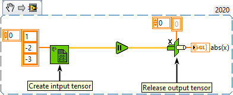

<h1>Device To Host & Free</h1>

<h2>Description</h2>

Copies data between device and host and free the tensor on the device. Type : <em><strong>polymorphic</strong><strong>.</strong></em>

Note : if “type” is empty, then all pointer values are copied, otherwise, only values of the size of the initialized “type” are copied.

<h3>Input parameters</h3>

<table>
  <tbody>
    <tr>
      <td width="64" valign="top"></td>
      <td valign="top"><strong>Tensor in : <em>class</em></strong></td>
    </tr>
    <tr>
      <td width="64" valign="top"></td>
      <td valign="top">type :<em> array or float, </em>type of tensor data (can be a scalar, 1D, 2D, 3D, 4D, 5D, 6D).</td>
    </tr>
  </tbody>
</table>

<h3>Output parameters</h3>

<table>
  <tbody>
    <tr>
      <td width="64" valign="top"></td>
      <td valign="top"><strong>data : <i>array or float, </i></strong>data of tensor (can be a scalar, 1D, 2D, 3D, 4D, 5D, 6D).</td>
    </tr>
  </tbody>
</table>

<h2>Examples</h2>

All these examples are snippets PNG, you can drop these Snippet onto the block diagram and get the depicted code added to your VI (Do not forget to install Accelerator library to run it).

