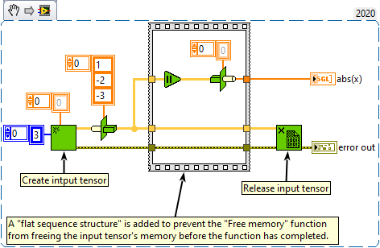

<h1>Host To Device</h1>

<h2>Description</h2>

Copies data between host and device. Type : <em><strong>polymorphic</strong><strong>.</strong></em>

<h3>Input parameters</h3>

<table>
  <tbody>
    <tr>
      <td width="64" valign="top"></td>
      <td valign="top"><strong>Tensor in : <em>class,</em></strong> tensor previously allocated with the “<a href="../create-tensor/README.md">Create Tensor</a>” function.</td>
    </tr>
    <tr>
      <td width="64" valign="top"></td>
      <td valign="top"><strong>data : array or <em>float, </em></strong>data of tensor (can be a scalar, 1D, 2D, 3D, 4D, 5D, 6D array).</td>
    </tr>
  </tbody>
</table>

<h3>Output parameters</h3>

<table>
  <tbody>
    <tr>
      <td width="64" valign="top"></td>
      <td valign="top"><strong>Tensor out : <i>class</i></strong></td>
    </tr>
  </tbody>
</table>

<h2>Examples</h2>

All these examples are snippets PNG, you can drop these Snippet onto the block diagram and get the depicted code added to your VI (Do not forget to install Accelerator library to run it).

