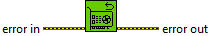
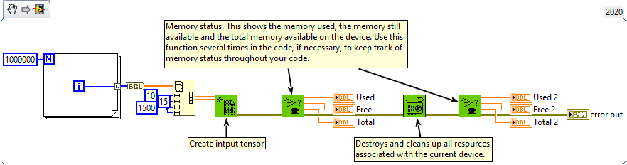

<h1>Reset Device</h1>

<h2>Description</h2>

Explicitly destroys and cleans up all resources associated with the current device in the current process.

<h2>Examples</h2>

All these examples are snippets PNG, you can drop these Snippet onto the block diagram and get the depicted code added to your VI (Do not forget to install Accelerator library to run it).

