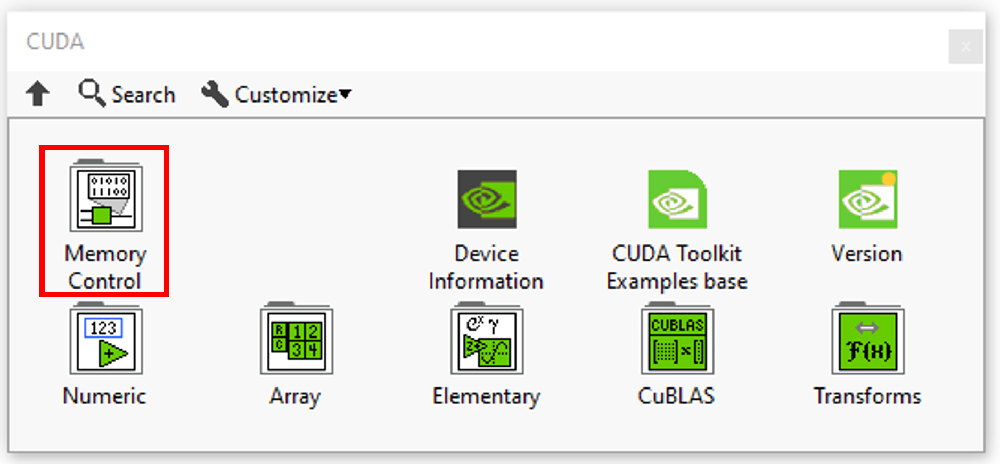
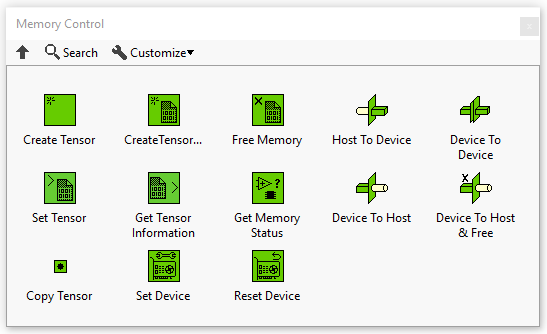
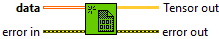
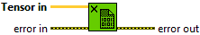
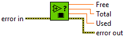
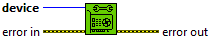
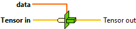
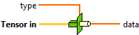
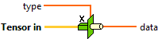

<h1>Memory Control Resume</h1>

<table>
  <tbody>
    <tr>
      <td valign="top" width="50%">

</td>
      <td valign="top" width="50%">

</td>
    </tr>
  </tbody>
</table>

In this section you’ll find a list of all memory control fonctionalities.

|  | **ICONS** | **DESCRIPTION** |
| --- | --- | --- |
| [Create Tensor](../create-tensor/README.md) |  | Allocates size bytes of linear memory on the device and returns a tensor to the allocated memory. |
| [Create Tensor & Host To Device](../../../_unmigrated/perrine-graiphic-io/create-tensor-and-host-to-device/README.md) |  | Allocates size bytes of linear memory on the device and copies data between host and device. Returns a tensor to the allocated memory. |
| [Free Memory](../free-memory/README.md) |  | Releases the memory space indicated by the tensor, which must have been returned by the “[Create Tensor](../create-tensor/README.md)” or “[Create Tensor & Host To Device](../../../_unmigrated/perrine-graiphic-io/create-tensor-and-host-to-device/README.md)” function call. |
| [Set Tensor](../set-tensor/README.md) |  | Initializes the tensor with the given value. |
| [Get Tensor Information](../get-tensor-information/README.md) |  | Information of the tensor. |
| [Get Memory Status](../../../_unmigrated/perrine-graiphic-io/get-memory-status/README.md) |  | Gets free, total and used device memory. |
| [Copy Tensor](../copy-tensor-2/README.md) |  | Copy the source tensor in tensor destination. |
| [Set Device](../set-device/README.md) |  | Set device to be used for GPU executions. |
| [Reset Device](../reset-device/README.md) |  | Explicitly destroys and cleans up all resources associated with the current device in the current process. |
| [Host To Device](../host-to-device/README.md) |  | Copies data between host and device. |
| [Device To Device](../device-to-device/README.md) |  | Copies data between device and device. |
| [Device To Host](../device-to-host/README.md) |  | Copies data between device and host. |
| [Device To Host & Free](../../../_unmigrated/perrine-graiphic-io/device-to-host-and-free/README.md) |  | Copies data between device and host and free the tensor on the device. |
