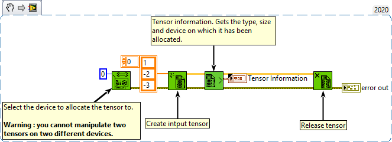

<h1>Set Device</h1>

<h2>Description</h2>

Set device to be used for GPU executions.

<h3>Input parameters</h3>

<table>
  <tbody>
    <tr>
      <td width="64" valign="top"></td>
      <td valign="top"><strong>device : <em>integer, </em></strong>device on which the active host thread should execute the device code.</td>
    </tr>
  </tbody>
</table>

<h2>Examples</h2>

All these examples are snippets PNG, you can drop these Snippet onto the block diagram and get the depicted code added to your VI (Do not forget to install Accelerator library to run it).

