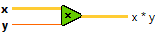
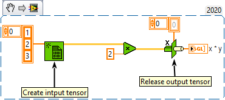
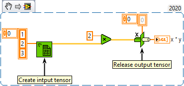
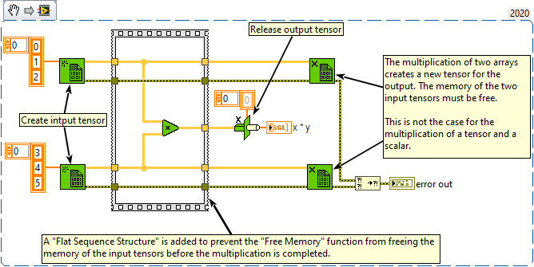

<h1>Multiply</h1>

<h2>Description</h2>

Returns the product of the inputs. Type : <em><strong>polymorphic</strong><strong>.</strong></em>

<strong>Warning : A new tensor is created for the output if you multiply two arrays together.</strong>

<h3>Input parameters</h3>

<table>
  <tbody>
    <tr>
      <td width="64" valign="top"></td>
      <td valign="top"><strong>x : <em>class, </em></strong>n-dimensional tensor (can be a scalar).</td>
    </tr>
    <tr>
      <td width="64" valign="top"></td>
      <td valign="top"><strong>y : <em>float,</em></strong> scalar (can be a tensor).</td>
    </tr>
  </tbody>
</table>

<h3>Output parameters</h3>

<table>
  <tbody>
    <tr>
      <td width="64" valign="top"></td>
      <td valign="top"><strong>x * y : <em>class,</em></strong> the product of x multiplied by y.</td>
    </tr>
  </tbody>
</table>

<h2>Examples</h2>

All these examples are snippets PNG, you can drop these Snippet onto the block diagram and get the depicted code added to your VI (Do not forget to install Accelerator library to run it).

<h3>Multiply tensor with a scalar</h3>

<h3>Multiply scalar with a tensor</h3>

<h3>Multiply a tensor to another tensor</h3>

