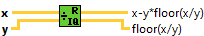
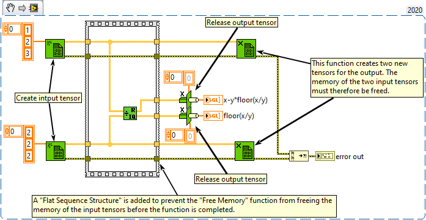

<h1>Quotient & Remainder</h1>

<h2>Description</h2>

Computes the integer quotient and the remainder of the inputs. This function rounds floor(x/y) to the nearest integer towards -inf.

<strong>Warning : Two new tensors is created for the outputs.</strong>

<h3>Input parameters</h3>

<table>
  <tbody>
    <tr>
      <td width="64" valign="top"></td>
      <td valign="top"><strong>x : <em>class, </em></strong>n-dimensional tensor.</td>
    </tr>
    <tr>
      <td width="64" valign="top"></td>
      <td valign="top"><strong>y : <em>class, </em></strong>n-dimensional tensor.</td>
    </tr>
  </tbody>
</table>

<h3>Output parameters</h3>

<table>
  <tbody>
    <tr>
      <td width="64" valign="top"></td>
      <td valign="top"><strong>x-y*floor(x/y) : <em>class,</em></strong> is the remainder. This corresponds to the modulo function of text-based programming languages. When y is 1, the remainder is the fractional part of x.</td>
    </tr>
    <tr>
      <td width="64" valign="top"></td>
      <td valign="top"><strong>floor(x/y) : <em>class,</em></strong> is the integer quotient. When y is 1, the quotient is the integer part of x.</td>
    </tr>
  </tbody>
</table>

<h2>Examples</h2>

All these examples are snippets PNG, you can drop these Snippet onto the block diagram and get the depicted code added to your VI (Do not forget to install Accelerator library to run it).

