<h1>Numeric Resume</h1>

<table>
  <tbody>
    <tr>
      <td valign="top" width="50%">
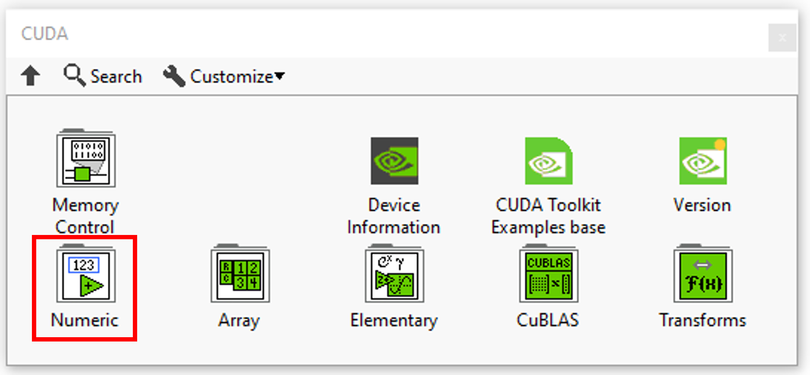
</td>
      <td valign="top" width="50%">
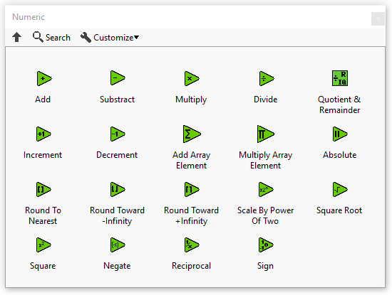
</td>
    </tr>
  </tbody>
</table>

In this section you’ll find a list of all numeric fonctionalities.

|  | **ICONS** | **DESCRIPTION** |
| --- | --- | --- |
| [Add](../add/README.md) | 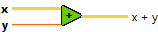 | Computes the sum of the inputs. |
| [Substract](../substract-2/README.md) | 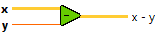 | Computes the difference of the inputs. |
| [Multiply](../multiply/README.md) |  | Returns the product of the inputs. |
| [Divide](../divide/README.md) | 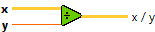 | Computes the quotient of the inputs. |
| [Quotient & Remainder](../quotient-remainder/README.md) |  | Computes the integer quotient and the remainder of the inputs. |
| [Increment](../increment-2/README.md) | 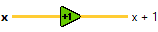 | Adds 1 to the input value. |
| [Decrement](../decrement-2/README.md) | 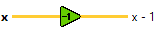 | Subtracts 1 from the input value. |
| [Add Array Element](../add-array-element/README.md) | 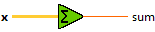 | Returns the sum of all the elements in input array. |
| [Multiply Array Element](../multiply-array-element/README.md) | 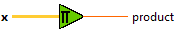 | Returns the product of all the elements in input array. |
| [Absolute](../absolute-2/README.md) |  | Returns the absolute value of the input. |
| [Round To Nearest](../round-to-nearest/README.md) | 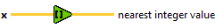 | Rounds the input to the nearest integer. |
| [Round Toward -Infinity](../round-toward-less-infinity/README.md) | 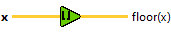 | Truncates the input to the next lowest integer. |
| [Round Toward +Infinity](../../../_unmigrated/perrine-graiphic-io/round-toward-more-infinity/README.md) |  | Rounds the input to the next highest integer. |
| [Scale By Power Of Two](../scale-power-of-two/README.md) | 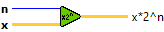 | Multiplies x by 2 raised to the power of n. |
| [Square Root](../square-root/README.md) | 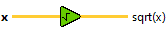 | Computes the square root of the input value. |
| [Square](../square-2/README.md) | 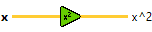 | Computes the square of the input value. |
| [Negate](../negate-2/README.md) |  | Negates the input value. |
| [Reciprocal](../reciprocal/README.md) | 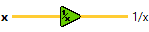 | Divides 1 by the input value. |
| [Sign](../sign/README.md) | 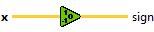 | Returns the sign of input. |
