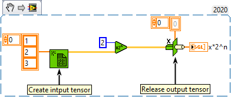

<h1>Scale By Power Of Two</h1>

<h2>Description</h2>

Multiplies x by 2 raised to the power of n.

<h3>Input parameters</h3>

<table>
  <tbody>
    <tr>
      <td width="64" valign="top"></td>
      <td valign="top"><strong>n : <em>integer,</em></strong> scalar number. This function rounds n before it scales x (0.5 rounds to 0; 0.51 rounds to 1).</td>
    </tr>
    <tr>
      <td width="64" valign="top"></td>
      <td valign="top"><strong>x : <em>class, </em></strong>n-dimensional tensor.</td>
    </tr>
  </tbody>
</table>

<h3>Output parameters</h3>

<table>
  <tbody>
    <tr>
      <td width="64" valign="top"></td>
      <td valign="top"><strong>x*2^n : <em>class,</em></strong> the result of multiplying x by 2, raised to the power of n.</td>
    </tr>
  </tbody>
</table>

<h2>Examples</h2>

All these examples are snippets PNG, you can drop these Snippet onto the block diagram and get the depicted code added to your VI (Do not forget to install Accelerator library to run it).

