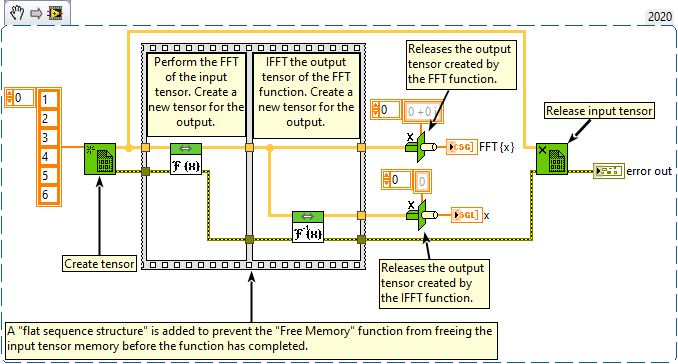

<h1>Inverse FFT</h1>

<h2>Description</h2>

Executes a single-precision complex-to-real, implicitly inverse, CUFFT transform plan. Type : <em><strong>polymorphic</strong><strong>.</strong></em>

<strong>Warning : The input tensor is also modified during FFT calculation. Warning : A new tensor is created for the output.</strong>

<h3>Input parameters</h3>

<table>
  <tbody>
    <tr>
      <td width="64" valign="top"></td>
      <td valign="top"><strong>x : <em>class, </em></strong>tensor to the complex input data (in GPU memory) to transform.</td>
    </tr>
  </tbody>
</table>

<h3>Output parameters</h3>

<table>
  <tbody>
    <tr>
      <td width="64" valign="top"></td>
      <td valign="top"><strong>y : <em>class, </em></strong>contains the real coefficients.</td>
    </tr>
  </tbody>
</table>

<h2>Examples</h2>

All these examples are snippets PNG, you can drop these Snippet onto the block diagram and get the depicted code added to your VI (Do not forget to install Accelerator library to run it).

