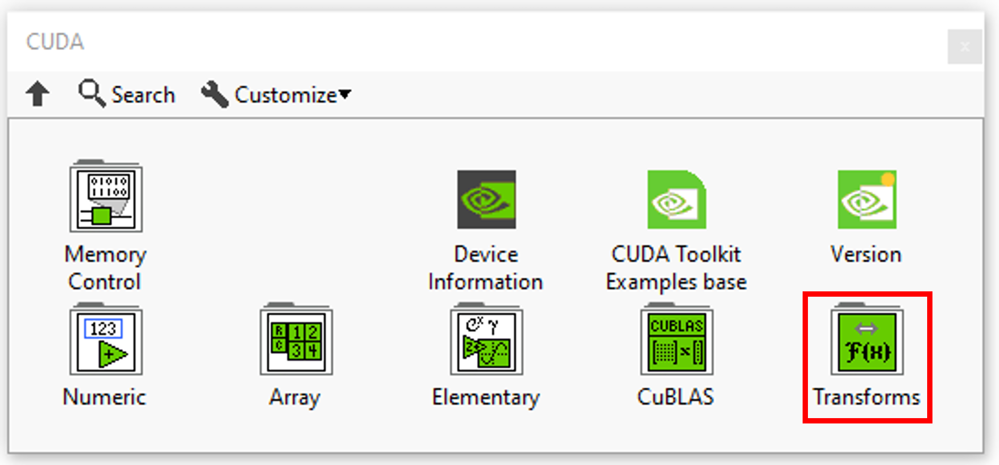
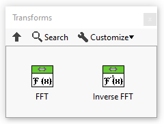

<h1>Transforms Resume</h1>

<table>
  <tbody>
    <tr>
      <td valign="top" width="50%">

</td>
      <td valign="top" width="50%">

</td>
    </tr>
  </tbody>
</table>

In this section you’ll find a list of all transforms fonctionalities.

|  | **ICONS** | **DESCRIPTION** |
| --- | --- | --- |
| [FFT](../fft/README.md) |  | Executes a single-precision real-to-complex, implicitly forward, cuFFT transform plan. |
| [Inverse FFT](../inverse-fft/README.md) |  | Executes a single-precision complex-to-real, implicitly inverse, CUFFT transform plan. |
