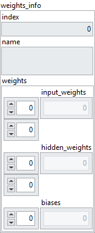

<h1>RNN (SimpleRNN)</h1>

<h2>Description</h2>

Gets the weights of the RNN selected by the index. Type : <em><strong>polymorphic</strong><strong>.</strong></em>

<h3>Input parameters</h3>

<table>
  <tbody>
    <tr>
      <td width="64" valign="top"></td>
      <td valign="top"><strong>Model in : </strong>model architecture.</td>
    </tr>
    <tr>
      <td width="64" valign="top"></td>
      <td valign="top"><strong>index : <em>integer</em>, </strong>index of layer.</td>
    </tr>
  </tbody>
</table>

<h3>Output parameters</h3>

<table>
  <tbody>
    <tr>
      <td width="64" valign="top"></td>
      <td valign="top"><strong>Model out : </strong>model architecture.</td>
    </tr>
  </tbody>
</table>

<table>
  <tbody>
    <tr>
      <td valign="top" width="70%"><table>
  <tbody>
    <tr>
      <td width="64" valign="top"></td>
      <td valign="top"><strong>weights_info : cluster</strong></td>
    </tr>
    <tr>
      <td></td>
      <td valign="top"><table>
  <tbody>
    <tr>
      <td width="64" valign="top"></td>
      <td valign="top"><strong>index : <em>integer, </em></strong>index of layer.</td>
    </tr>
    <tr>
      <td width="64" valign="top"></td>
      <td valign="top"><strong>name : <em>string, </em></strong>name of layer.</td>
    </tr>
    <tr>
      <td width="64" valign="top"></td>
      <td valign="top"><strong>weights : cluster</strong></td>
    </tr>
    <tr>
      <td></td>
      <td valign="top"><table>
  <tbody>
    <tr>
      <td width="64" valign="top"></td>
      <td valign="top"><strong>input_weights : <em>array, </em></strong>2D values. input_weights = [features, units].</td>
    </tr>
    <tr>
      <td width="64" valign="top"></td>
      <td valign="top"><strong>hidden_weights : <em>array, </em></strong>2D values. hidden_weights = [units, units].</td>
    </tr>
    <tr>
      <td width="64" valign="top"></td>
      <td valign="top"><strong>biases : <em>array, </em></strong>1D values. biases = [units].</td>
    </tr>
  </tbody>
</table></td>
    </tr>
  </tbody>
</table></td>
    </tr>
  </tbody>
</table></td>
      <td valign="top" width="30%">

</td>
    </tr>
  </tbody>
</table>

<h2>Dimension</h2>

<ul>
<li>input_weights = [features, units]</li>
</ul>

The size depends on the <a href="../../../../architecture/layers/simple-rnn-add-to-graph/README.md">SimpleRNN</a> layer input and the units parameter.  For example, if the input has a size of [batch = 10, timesteps = 8, features = 5] and units a value of 3 then input_weights will have a size of [features = 5, units = 3].  Another example, if the input has a size of [batch = 15, timesteps = 8, features = 6] and units a value of 2 then input_weights will have a size of [features = 6, units = 2].

<ul>
<li>hidden_weights = [units, units]</li>
</ul>

The size depends on the units parameter of the <a href="../../../../architecture/layers/simple-rnn-add-to-graph/README.md">SimpleRNN</a> layer. For example, if units has a value of 6 then hidden_weights will have a size of [units = 6, units = 6].  Another example, if units has a value of 2 then hidden_weights will have a size of [units = 2, units = 2].

<ul>
<li>biases = [units]</li>
</ul>

The size depends on the units parameter of the <a href="../../../../architecture/layers/simple-rnn-add-to-graph/README.md">SimpleRNN</a> layer.  For example, if units has a value of 6, then biases will have a size of [units = 6].  Another example, if units has a value of 2, then biases will have a size of [units = 2].

<h2>Example</h2>

All these exemples are snippets PNG, you can drop these Snippet onto the block diagram and get the depicted code added to your VI (Do not forget to install Deep Learning library to run it).

