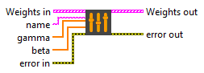

<h1>LayerNormalization</h1>

<h2>Description</h2>

Adds the weights of the LayerNormalization layer to the weights table. Type : <em><strong>polymorphic</strong><strong>.</strong></em>

<h3>Input parameters</h3>

<table>
  <tbody>
    <tr>
      <td valign="top" width="70%"><table>
  <tbody>
    <tr>
      <td width="64" valign="top"></td>
      <td valign="top"><strong>Weights in : array</strong></td>
    </tr>
    <tr>
      <td></td>
      <td valign="top"><table>
  <tbody>
    <tr>
      <td width="64" valign="top"></td>
      <td valign="top"><strong>name : <em>string</em>, </strong>name of layer.</td>
    </tr>
    <tr>
      <td width="64" valign="top"></td>
      <td valign="top"><strong>weights : <em>variant,</em></strong> weights values.</td>
    </tr>
  </tbody>
</table></td>
    </tr>
  </tbody>
</table></td>
      <td valign="top" width="30%">

</td>
    </tr>
  </tbody>
</table>

<table>
  <tbody>
    <tr>
      <td width="64" valign="top"></td>
      <td valign="top"><strong>name : <em>string</em>, </strong>name of layer.</td>
    </tr>
    <tr>
      <td width="64" valign="top"></td>
      <td valign="top"><strong>gamma : <em>array, </em></strong>1D values. gamma = [input_dim1].</td>
    </tr>
    <tr>
      <td width="64" valign="top"></td>
      <td valign="top"><strong>beta : <em>array, </em></strong>1D values. beta = [input_dim1].</td>
    </tr>
  </tbody>
</table>

<h3>Output parameters</h3>

<table>
  <tbody>
    <tr>
      <td valign="top" width="70%"><table>
  <tbody>
    <tr>
      <td width="64" valign="top"></td>
      <td valign="top"><strong>Weights out : array</strong></td>
    </tr>
    <tr>
      <td></td>
      <td valign="top"><table>
  <tbody>
    <tr>
      <td width="64" valign="top"></td>
      <td valign="top"><strong>name : <em>string</em>, </strong>name of layer.</td>
    </tr>
    <tr>
      <td width="64" valign="top"></td>
      <td valign="top"><strong>weights : <em>variant,</em></strong> weights values.</td>
    </tr>
  </tbody>
</table></td>
    </tr>
  </tbody>
</table></td>
      <td valign="top" width="30%">

</td>
    </tr>
  </tbody>
</table>

<h2>Dimension</h2>

<ul>
<li>gamma = [input_dim1]</li>
</ul>

The size depends on the input to the <a href="../../../../architecture/layers/layer-norm-add-to-graph/README.md">LayerNormalization</a> layer. For example, if the layer input has a size of [batch_size = 10, input_dim1 = 5, input_dim2 = 4, input_dim3 = 2] then gamma will have a size of [input_dim1 = 5]. Another example, if the input of the layer has a size of [batch_size = 12, input_dim1 = 8, input_dim2 = 5, input_dim3 = 3] then gamma will have a size of [input_dim1 = 8].

<ul>
<li>beta = [input_dim1]</li>
</ul>

The beta size is based on the same principle as the gamma size.

<h2>Example</h2>

All these exemples are snippets PNG, you can drop these Snippet onto the block diagram and get the depicted code added to your VI (Do not forget to install Deep Learning library to run it).

