<h1>Resume</h1>

<table>
  <tbody>
    <tr>
      <td valign="top" width="62%">

</td>
      <td valign="top" width="38%">
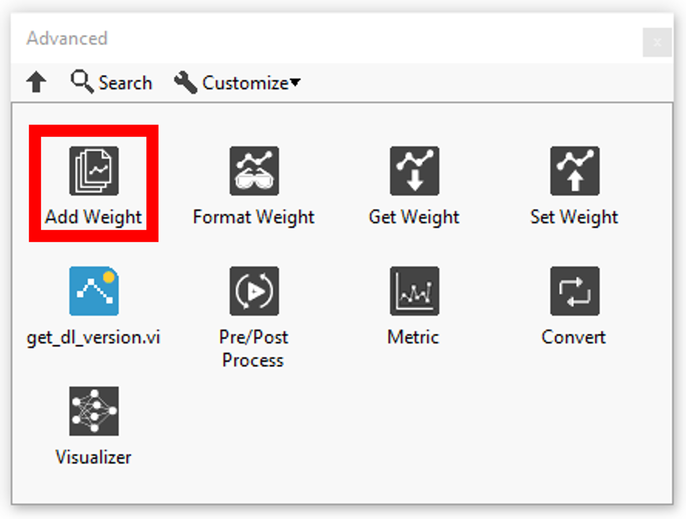
</td>
    </tr>
  </tbody>
</table>

<h2>ADD</h2>

In this section you will find a list for add the weights data.

| ### INDEX |  |  |
| --- | --- | --- |
|  | **ICONS** | **RESUME** |
| [PReLU 2D](../deep-learning-input-index/prelu-2d/README.md) | 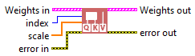 | Adds the weight of the PReLU2D layer to the weights table. |
| [PReLU 3D](../deep-learning-input-index/prelu-3d/README.md) | 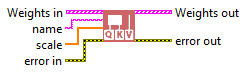 | Adds the weight of the PReLU3D layer to the weights table. |
| [PReLU 4D](../deep-learning-input-index/prelu-4d/README.md) | 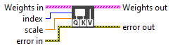 | Adds the weight of the PReLU4D layer to the weights table. |
| [PReLU 5D](../deep-learning-input-index/prelu-5d/README.md) | 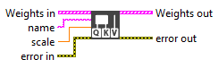 | Adds the weight of the PReLU5D layer to the weights table. |
| [AdditiveAttention](../deep-learning-input-index/additiveattention/README.md) | 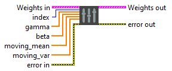 | Adds the weight of the AdditiveAttention layer to the weights table. |
| [Attention](../deep-learning-input-index/attention/README.md) | 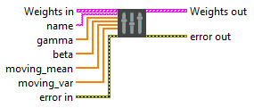 | Adds the weight of the Attention layer to the weights table. |
| [MultiHeadAttention](../deep-learning-input-index/mutiheadattention/README.md) | 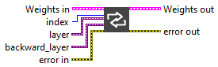 | Adds the weights of the MultiHeadAttention layer to the weights table. |
| [Conv1D](../deep-learning-input-index/conv1d/README.md) | 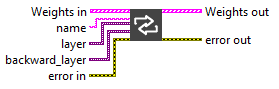 | Adds the weights of the Conv1D layer to the weights table. |
| [Conv2D](../deep-learning-input-index/conv2d/README.md) | 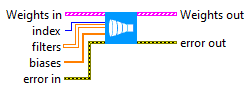 | Adds the weights of the Conv2D layer to the weights table. |
| [Conv3D](../deep-learning-input-index/conv3d/README.md) | 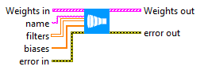 | Adds the weights of the Conv3D layer to the weights table. |
| [ConvLSTM1D](../deep-learning-input-index/convlstm1d/README.md) | 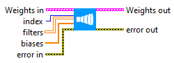 | Adds the weights of the ConvLSTM1D layer to the weights table. |
| [ConvLSTM2D](../deep-learning-input-index/convlstm2d/README.md) | 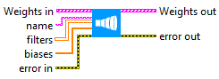 | Adds the weights of the ConvLSTM2D layer to the weights table. |
| [ConvLSTM3D](../deep-learning-input-index/convlstm3d/README.md) | 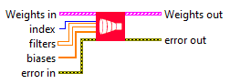 | Adds the weights of the ConvLSTM3D layer to the weights table. |
| [Conv1DTranspose](../deep-learning-input-index/conv1dtranspose/README.md) | 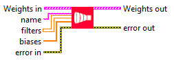 | Adds the weights of the Conv1DTranspose layer to the weights table. |
| [Conv2DTranspose](../deep-learning-input-index/conv2dtranspose/README.md) | 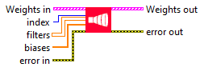 | Adds the weights of the Conv2DTranspose layer to the weights table. |
| [Conv3DTranspose](../deep-learning-input-index/conv3dtranspose/README.md) | 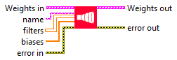 | Adds the weights of the Conv3DTranspose layer to the weights table. |
| [DepthwiseConv2D](../deep-learning-input-index/depthwiseconv2d/README.md) | 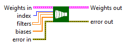 | Adds the weights of the DepthwiseConv2D layer to the weights table. |
| [SeparableConv1D](../deep-learning-input-index/separableconv1d/README.md) | 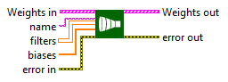 | Adds the weights of the SeparableConv1D layer to the weights table. |
| [SeparableConv2D](../deep-learning-input-index/separableconv2d/README.md) | 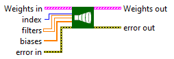 | Adds the weights of the SeparableConv2D layer to the weights table. |
| [Dense](../deep-learning-input-index/dense/README.md) | 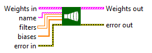 | Adds the weights of the Dense layer to the weights table. |
| [Embedding](../deep-learning-input-index/embedding/README.md) | 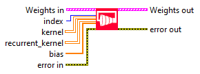 | Adds the weight of the Embedding layer to the weights table. |
| [BatchNormalization](../deep-learning-input-index/batchnormalization/README.md) | 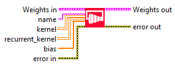 | Adds the weights of the BatchNormalization layer to the weights table. |
| [LayerNormalization](../deep-learning-input-index/layernormalization/README.md) | 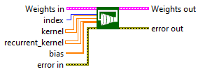 | Adds the weights of the LayerNormalization layer to the weights table. |
| [Bidirectional](../deep-learning-input-index/bidirectional/README.md) | 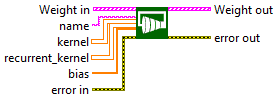 | Adds the weights of the Bidirectional layer to the weights table. |
| [GRU](../deep-learning-input-index/gru/README.md) | 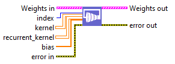 | Adds the weights of the GRU layer to the weights table. |
| [LSTM](../deep-learning-input-index/lstm/README.md) | 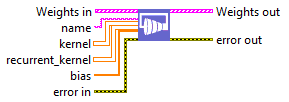 | Adds the weights of the LSTM layer to the weights table. |
| [SimpleRNN](../deep-learning-input-index/simplernn-2/README.md) | 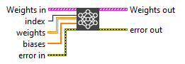 | Adds the weights of the SimpleRNN layer to the weights table. |
| ### NAME |  |  |
|  | **ICONS** | **RESUME** |
| [PReLU 2D](../deep-learning-input-name/prelu-2d-2/README.md) |  | Adds the weight of the PReLU2D layer to the weights table. |
| [PReLU 3D](../deep-learning-input-name/prelu-3d-2/README.md) | 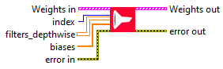 | Adds the weight of the PReLU3D layer to the weights table. |
| [PReLU 4D](../deep-learning-input-name/prelu-4d-2/README.md) | 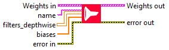 | Adds the weight of the PReLU4D layer to the weights table. |
| [PReLU 5D](../deep-learning-input-name/prelu-5d-2/README.md) | 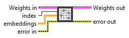 | Adds the weight of the PReLU5D layer to the weights table. |
| [AdditiveAttention](../deep-learning-input-name/additiveattention-2/README.md) | 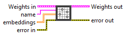 | Adds the weight of the AdditiveAttention layer to the weights table. |
| [Attention](../deep-learning-input-name/attention-2/README.md) | 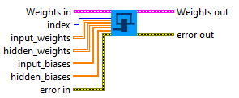 | Adds the weight of the Attention layer to the weights table. |
| [MultiHeadAttention](../deep-learning-input-name/multiheadattention/README.md) | 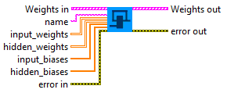 | Adds the weights of the MultiHeadAttention layer to the weights table. |
| [Conv1D](../deep-learning-input-name/conv1d-2/README.md) | 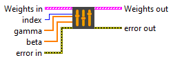 | Adds the weights of the Conv1D layer to the weights table. |
| [Conv2D](../deep-learning-input-name/conv2d-2/README.md) |  | Adds the weights of the Conv2D layer to the weights table. |
| [Conv3D](../deep-learning-input-name/conv3d-2/README.md) | 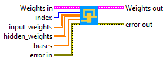 | Adds the weights of the Conv3D layer to the weights table. |
| [ConvLSTM1D](../deep-learning-input-name/convlstm1d-2/README.md) | 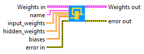 | Adds the weights of the ConvLSTM1D layer to the weights table. |
| [ConvLSTM2D](../deep-learning-input-name/convlstm2d-2/README.md) | 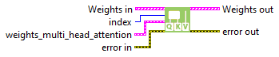 | Adds the weights of the ConvLSTM2D layer to the weights table. |
| [ConvLSTM3D](../deep-learning-input-name/convlstm3d-2/README.md) | 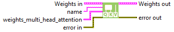 | Adds the weights of the ConvLSTM3D layer to the weights table. |
| [Conv1DTranspose](../deep-learning-input-name/conv1dtranspose-2/README.md) |  | Adds the weights of the Conv1DTranspose layer to the weights table. |
| [Conv2DTranspose](../deep-learning-input-name/conv2dtranspose-2/README.md) | 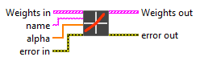 | Adds the weights of the Conv2DTranspose layer to the weights table. |
| [Conv3DTranspose](../deep-learning-input-name/conv3dtranspose-2/README.md) | 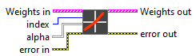 | Adds the weights of the Conv3DTranspose layer to the weights table. |
| [DepthwiseConv2D](../deep-learning-input-name/depthwiseconv2d-2/README.md) | 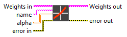 | Adds the weights of the DepthwiseConv2D layer to the weights table. |
| [SeparableConv1D](../deep-learning-input-name/separableconv1d-2/README.md) | 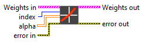 | Adds the weights of the SeparableConv1D layer to the weights table. |
| [SeparableConv2D](../deep-learning-input-name/separableconv2d-2/README.md) | 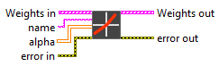 | Adds the weights of the SeparableConv2D layer to the weights table. |
| [Dense](../deep-learning-input-name/dense-2/README.md) | 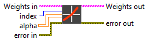 | Adds the weights of the Dense layer to the weights table. |
| [Embedding](../deep-learning-input-name/embedding-2/README.md) | 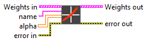 | Adds the weight of the Embedding layer to the weights table. |
| [BatchNormalization](../deep-learning-input-name/batchnormalization-2/README.md) | 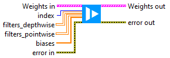 | Adds the weights of the BatchNormalization layer to the weights table. |
| [LayerNormalization](../deep-learning-input-name/layernormalization-2/README.md) | 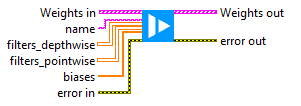 | Adds the weights of the LayerNormalization layer to the weights table. |
| [Bidirectional](../deep-learning-input-name/bidirectional-2/README.md) | 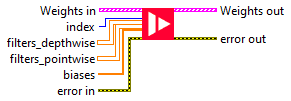 | Adds the weights of the Bidirectional layer to the weights table. |
| [GRU](../deep-learning-input-name/gru-2/README.md) | 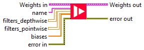 | Adds the weights of the GRU layer to the weights table. |
| [LSTM](../deep-learning-input-name/lstm-2/README.md) |  | Adds the weights of the LSTM layer to the weights table. |
| [SimpleRNN](../deep-learning-input-name/simplernn/README.md) |  | Adds the weights of the SimpleRNN layer to the weights table. |
