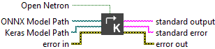

<h1>Convert ONNX To Keras</h1>

<h2>Description</h2>

This VI transforms a .onnx model file into the native .keras format introduced in Keras 3.x. It enables seamless reuse of ONNX models inside modern TensorFlow/Keras workflows. Optionally, the source ONNX model can be visualized in Netron.

<h3>Input parameters</h3>

<table>
  <tbody>
    <tr>
      <td width="64" valign="top"></td>
      <td valign="top"><strong>Open Netron : <em>boolean, </em></strong>indicating whether to automatically open the resulting ONNX file in Netron after conversion. If true opens in Netron else conversion only.</td>
    </tr>
    <tr>
      <td width="64" valign="top"></td>
      <td valign="top"><strong>ONNX Model Path : <em>path</em>, </strong>path to the <code>.onnx</code> file to convert. The file must contain a valid ONNX model.</td>
    </tr>
    <tr>
      <td width="64" valign="top"></td>
      <td valign="top"><strong>Keras Model Path : <em>path</em>, </strong>path to the output <code>.keras</code> file where the converted model will be saved (Keras 3.x format).</td>
    </tr>
  </tbody>
</table>

<h3>Output parameters</h3>

<table>
  <tbody>
    <tr>
      <td width="64" valign="top"></td>
      <td valign="top"><strong>standard output : <em>string, </em></strong>text output from the underlying Python process. Can include logs, conversion info, or warnings.</td>
    </tr>
    <tr>
      <td width="64" valign="top"></td>
      <td valign="top"><strong>standard error : <em>string, </em></strong>text output capturing any error messages from the Python process, useful for debugging failed conversions.</td>
    </tr>
  </tbody>
</table>

<h2>Example</h2>

All these exemples are snippets PNG, you can drop these Snippet onto the block diagram and get the depicted code added to your VI (Do not forget to install Deep Learning library to run it).

