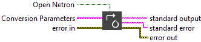
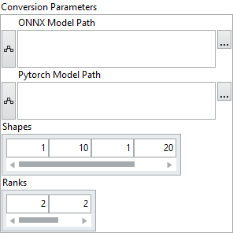

<h1>Convert ONNX To Pytorch</h1>

<h2>Description</h2>

This VI exports an ONNX model into the PyTorch .pt format using a Python-based toolchain. Because TorchScript requires explicit input shapes for tracing, the user must provide input shapes and their corresponding ranks. Optionally, the ONNX model can be opened in Netron after conversion.

<h3>Input parameters</h3>

<table>
  <tbody>
    <tr>
      <td width="64" valign="top"></td>
      <td valign="top"><strong>Open Netron : <em>boolean, </em></strong>indicating whether to automatically open the resulting ONNX file in Netron after conversion. If true opens in Netron else conversion only.</td>
    </tr>
  </tbody>
</table>

<table>
  <tbody>
    <tr>
      <td valign="top" width="70%">
<strong>Conversion Parameters : <em>cluster,</em></strong>

<table>
  <tbody>
    <tr>
      <td width="64" valign="top"></td>
      <td valign="top"><strong>ONNX Model Path : <em>path</em>, </strong>path to the <code>.onnx</code> file to convert. Must contain a valid and traceable ONNX graph.</td>
    </tr>
    <tr>
      <td width="64" valign="top"></td>
      <td valign="top"><strong>Pytorch Model Path : <em>path</em>, </strong>path to the <code>.pt</code> file where the TorchScript model will be saved.</td>
    </tr>
    <tr>
      <td width="64" valign="top"></td>
      <td valign="top"><strong>Shapes : <em>array, </em></strong>a flattened 1D array representing all input tensor shapes, concatenated. Each shape must be fully specified (e.g., <code>[1, 3, 224, 224, 1, 10]</code>).</td>
    </tr>
    <tr>
      <td width="64" valign="top"></td>
      <td valign="top"><strong>Ranks : <em>array, </em></strong>specifying the rank (number of dimensions) of each input tensor. This array is used to split the flat <code>Shapes</code> array into individual shapes for each input.</td>
    </tr>
  </tbody>
</table></td>
      <td valign="top" width="30%">

</td>
    </tr>
  </tbody>
</table>

<h3>Output parameters</h3>

<table>
  <tbody>
    <tr>
      <td width="64" valign="top"></td>
      <td valign="top"><strong>standard output : <em>string, </em></strong>text output from the underlying Python process. Can include logs, conversion info, or warnings.</td>
    </tr>
    <tr>
      <td width="64" valign="top"></td>
      <td valign="top"><strong>standard error : <em>string, </em></strong>text output capturing any error messages from the Python process, useful for debugging failed conversions.</td>
    </tr>
  </tbody>
</table>

<h2>Example</h2>

All these exemples are snippets PNG, you can drop these Snippet onto the block diagram and get the depicted code added to your VI (Do not forget to install Deep Learning library to run it).

