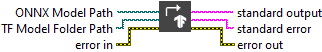

<h1>Convert ONNX To TF SavedModel</h1>

<h2>Description</h2>

This VI transforms a .onnx file into a TensorFlow model using the standard SavedModel directory structure. This format is compatible with TensorFlow Serving and allows easy integration into TensorFlow-based pipelines.

<h3>Input parameters</h3>

<table>
  <tbody>
    <tr>
      <td width="64" valign="top"></td>
      <td valign="top"><strong>Open Netron : <em>boolean, </em></strong>indicating whether to automatically open the resulting ONNX file in Netron after conversion. If true opens in Netron else conversion only.</td>
    </tr>
    <tr>
      <td width="64" valign="top"></td>
      <td valign="top"><strong>ONNX Model Path : <em>path</em>, </strong>path to the ONNX model file (<code>.onnx</code>) to convert. Must contain a valid ONNX graph.</td>
    </tr>
    <tr>
      <td width="64" valign="top"></td>
      <td valign="top"><strong>TF Model Folder Path : <em>path</em>, </strong>destination directory where the converted TensorFlow model will be saved. A new folder will be created (if it doesn’t already exist) containing the standard <code>SavedModel</code> format (<code>saved_model.pb</code>, variables, etc.).</td>
    </tr>
  </tbody>
</table>

<h3>Output parameters</h3>

<table>
  <tbody>
    <tr>
      <td width="64" valign="top"></td>
      <td valign="top"><strong>standard output : <em>string, </em></strong>text output from the underlying Python process. Can include logs, conversion info, or warnings.</td>
    </tr>
    <tr>
      <td width="64" valign="top"></td>
      <td valign="top"><strong>standard error : <em>string, </em></strong>text output capturing any error messages from the Python process, useful for debugging failed conversions.</td>
    </tr>
  </tbody>
</table>

<h2>Example</h2>

All these exemples are snippets PNG, you can drop these Snippet onto the block diagram and get the depicted code added to your VI (Do not forget to install Deep Learning library to run it).

