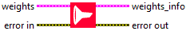
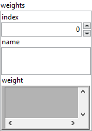
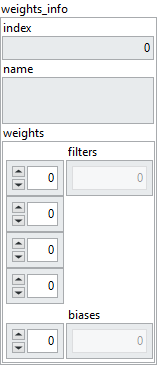

<h1>DepthwiseConv2D</h1>

<h2>Description</h2>

Returns the DepthwiseConv2D layer weights. Type : <em><strong>polymorphic</strong><strong>.</strong></em>

<h3>Input parameters</h3>

<table>
  <tbody>
    <tr>
      <td valign="top" width="70%"><table>
  <tbody>
    <tr>
      <td width="64" valign="top"></td>
      <td valign="top"><strong>weights : cluster</strong></td>
    </tr>
    <tr>
      <td></td>
      <td valign="top"><table>
  <tbody>
    <tr>
      <td width="64" valign="top"></td>
      <td valign="top"><strong>index : <em>integer, </em></strong>index of layer.</td>
    </tr>
    <tr>
      <td width="64" valign="top"></td>
      <td valign="top"><strong>name : <em>string, </em></strong>name of layer.</td>
    </tr>
    <tr>
      <td width="64" valign="top"></td>
      <td valign="top"><strong>weight : <em>variant, </em></strong>weight of layer.</td>
    </tr>
  </tbody>
</table></td>
    </tr>
  </tbody>
</table></td>
      <td valign="top" width="30%">

</td>
    </tr>
  </tbody>
</table>

<h3>Output parameters</h3>

<table>
  <tbody>
    <tr>
      <td valign="top" width="70%"><table>
  <tbody>
    <tr>
      <td width="64" valign="top"></td>
      <td valign="top"><strong>weights_info : cluster</strong></td>
    </tr>
    <tr>
      <td></td>
      <td valign="top"><table>
  <tbody>
    <tr>
      <td width="64" valign="top"></td>
      <td valign="top"><strong>index : <em>integer, </em></strong>index of layer.</td>
    </tr>
    <tr>
      <td width="64" valign="top"></td>
      <td valign="top"><strong>name : <em>string, </em></strong>name of layer.</td>
    </tr>
    <tr>
      <td width="64" valign="top"></td>
      <td valign="top"><strong>weights : cluster</strong></td>
    </tr>
    <tr>
      <td></td>
      <td valign="top"><table>
  <tbody>
    <tr>
      <td width="64" valign="top"></td>
      <td valign="top"><strong>filters_depthwise : <em>array, </em></strong>4D values. filters_depthwise = [channels, 1, size[0], size[1]].</td>
    </tr>
    <tr>
      <td width="64" valign="top"></td>
      <td valign="top"><strong>biases : <em>array, </em></strong>1D values. biases = [channels].</td>
    </tr>
  </tbody>
</table></td>
    </tr>
  </tbody>
</table></td>
    </tr>
  </tbody>
</table></td>
      <td valign="top" width="30%">

</td>
    </tr>
  </tbody>
</table>

<h2>Dimension</h2>

<ul>
<li>filters_depthwise = [channels, 1, size[0], size[1]]</li>
</ul>

The size of filters_depthwise depends on the input of the <a href="../../../architecture/layers/depthwise-conv-2d-add-to-graph/README.md">DepthwiseConv2D</a> layer and the parameters size. For example if the input of the layer has a size of [batch_size = 10, channels = 8, rows = 5, cols = 5] and size the value [3, 3] then filters will have a size of [channels = 8, 1, size[0] = 3, size[1] = 3].

<ul>
<li>biases = [channels]</li>
</ul>

The size of biases depends on the parameter size of the <a href="../../../architecture/layers/depthwise-conv-2d-add-to-graph/README.md">DepthwiseConv2D</a> layer. For example, if the input of the layer has a size of [batch_size = 10, channels = 8, rows = 5, cols = 5] then biases will have a size of [channels = 8].

<h2>Example</h2>

All these exemples are snippets PNG, you can drop these Snippet onto the block diagram and get the depicted code added to your VI (Do not forget to install Deep Learning library to run it).

