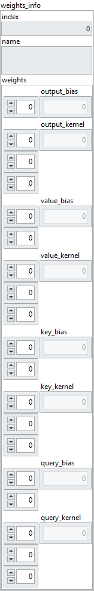

<h1>MultiHeadAttention</h1>

<h2>Description</h2>

Returns the MultiHeadAttention layer weights. Type : <em><strong>polymorphic</strong><strong>.</strong></em>

<h3>Input parameters</h3>

<table>
  <tbody>
    <tr>
      <td valign="top" width="70%"><table>
  <tbody>
    <tr>
      <td width="64" valign="top"></td>
      <td valign="top"><strong>weights : cluster</strong></td>
    </tr>
    <tr>
      <td></td>
      <td valign="top"><table>
  <tbody>
    <tr>
      <td width="64" valign="top"></td>
      <td valign="top"><strong>index : <em>integer, </em></strong>index of layer.</td>
    </tr>
    <tr>
      <td width="64" valign="top"></td>
      <td valign="top"><strong>name : <em>string, </em></strong>name of layer.</td>
    </tr>
    <tr>
      <td width="64" valign="top"></td>
      <td valign="top"><strong>weight : <em>variant, </em></strong>weight of layer.</td>
    </tr>
  </tbody>
</table></td>
    </tr>
  </tbody>
</table></td>
      <td valign="top" width="30%">

</td>
    </tr>
  </tbody>
</table>

<h3>Output parameters</h3>

<table>
  <tbody>
    <tr>
      <td valign="top" width="70%"><table>
  <tbody>
    <tr>
      <td width="64" valign="top"></td>
      <td valign="top"><strong>weights_info : cluster</strong></td>
    </tr>
    <tr>
      <td></td>
      <td valign="top"><table>
  <tbody>
    <tr>
      <td width="64" valign="top"></td>
      <td valign="top"><strong>index : <em>integer, </em></strong>index of layer.</td>
    </tr>
    <tr>
      <td width="64" valign="top"></td>
      <td valign="top"><strong>name : <em>string, </em></strong>name of layer.</td>
    </tr>
    <tr>
      <td width="64" valign="top"></td>
      <td valign="top"><strong>weights : cluster</strong></td>
    </tr>
    <tr>
      <td></td>
      <td valign="top"><table>
  <tbody>
    <tr>
      <td width="64" valign="top"></td>
      <td valign="top"><strong>output_bias : <em>array</em>, </strong>1D values. output_bias = query[2].</td>
    </tr>
    <tr>
      <td width="64" valign="top"></td>
      <td valign="top"><strong>output_kernel : <em>array</em>, </strong>3D values. output_kernel = [num_heads, value_dim, query[2]].</td>
    </tr>
    <tr>
      <td width="64" valign="top"></td>
      <td valign="top"><strong>value_bias : <em>array</em>, </strong>2D values. value_bias = [num_heads, value_dim].</td>
    </tr>
    <tr>
      <td width="64" valign="top"></td>
      <td valign="top"><strong>value_kernel : <em>array</em>, </strong>3D values. value_kernel = [value[2], num_heads, value_dim].</td>
    </tr>
    <tr>
      <td width="64" valign="top"></td>
      <td valign="top"><strong>key_bias : <em>array</em>, </strong>2D values. key_bias = [num_heads, key_dim].</td>
    </tr>
    <tr>
      <td width="64" valign="top"></td>
      <td valign="top"><strong>key_kernel : <em>array</em>, </strong>3D values. key_kernel = [key[2], num_heads, key_dim].</td>
    </tr>
    <tr>
      <td width="64" valign="top"></td>
      <td valign="top"><strong>query_bias : <em>array</em>, </strong>2D values. query_bias = [num_heads, key_dim].</td>
    </tr>
    <tr>
      <td width="64" valign="top"></td>
      <td valign="top"><strong>query_kernel : <em>array</em>, </strong>3D values. query_kernel = [query[2], num_heads, key_dim].</td>
    </tr>
  </tbody>
</table></td>
    </tr>
  </tbody>
</table></td>
    </tr>
  </tbody>
</table></td>
      <td valign="top" width="30%">

</td>
    </tr>
  </tbody>
</table>

<h2>Dimension</h2>

<ul>
<li>output_bias = query[2]</li>
</ul>

The size of output_bias depends on the query input size of the <a href="../../../architecture/layers/multi-head-attention-add-to-graph/README.md">MultiHeadAttention</a> layer. It will take the value at index 2 of the query size. 
For example, if query has a size of [batch_size = 5, Tq = 3, dim = 2] then the size of output_bias is [dim = 2]. 
Another example, if query has a size of [batch_size = 10, Tq = 9, dim = 5] then the size of output_bias is [dim = 5].

<ul>
<li>output_kernel = [num_heads, value_dim, query[2]]</li>
</ul>

The size of output_kernel depends on the query input size, the num_heads parameter and the value_dim parameter of the <a href="../../../architecture/layers/multi-head-attention-add-to-graph/README.md">MultiHeadAttention</a> layer. For the input size of query it will take the value at index 2. 
For example, if query has a size of [batch_size = 5, Tq = 3, dim = 2], num_heads a value of 8 and value_dim a value of 5 then the output_kernel size is [num_heads = 8, value_dim = 5, dim = 2]. 
Another example, if query has a size of [batch_size = 10, Tq = 9, dim = 4], num_heads a value of 6 and value_dim a value of 5 then the output_kernel size is [num_heads = 6, value_dim = 5, dim = 4].

<ul>
<li>value_bias = [num_heads, value_dim]</li>
</ul>

The size of value_bias depends on the num_heads parameter and the value_dim parameter of the <a href="../../../architecture/layers/multi-head-attention-add-to-graph/README.md">MultiHeadAttention</a> layer. For example, if num_heads has a value of 8 and value_dim a value of 5 then the size of value_bias is [8, 5]. Another example, if num_heads has a value of 6 and value_dim a value of 4 then the size of value_bias is [6, 4].

<ul>
<li>value_kernel = [value[2], num_heads, value_dim]</li>
</ul>

The size of value_kernel depends on the input size of value, the num_heads parameter and the value_dim parameter of the <a href="../../../architecture/layers/multi-head-attention-add-to-graph/README.md">MultiHeadAttention</a> layer. For the input size of value, it will take the value at index 2. 
For example, if value has a size of [batch_size = 5, Tv = 3, dim = 2], num_heads a value of 8 and value_dim a value of 5, then the size of value_kernel is [dim = 2, num_heads = 8, value_dim = 5]. 
Another example, if value has a size of [batch_size = 10, Tv = 9, dim = 4], num_heads a value of 6 and value_dim a value of 5, then the size of value_kernel is [dim = 4, num_heads = 6, value_dim = 5].

<ul>
<li>key_bias = [num_heads, key_dim]</li>
</ul>

The size of key_bias depends on the num_heads parameter and the key_dim parameter of the <a href="../../../architecture/layers/multi-head-attention-add-to-graph/README.md">MultiHeadAttention</a> layer. 
For example, if num_heads has a value of 8 and key_dim a value of 5, the size of key_bias is [num_heads = 8, key_dim = 5]. 
Another example, if num_heads has a value of 6 and key_dim a value of 4, the size of key_bias is [num_heads = 6, key_dim = 4].

<ul>
<li>key_kernel = [key[2], num_heads, key_dim]</li>
</ul>

The size of key_kernel depends on the input size of key, the num_heads parameter and the key_dim parameter of the <a href="../../../architecture/layers/multi-head-attention-add-to-graph/README.md">MultiHeadAttention</a> layer. For the input size of key, it will take the value at index 2. 
For example, if key has a size of [batch_size = 5, Tv = 3, dim = 2], num_heads a value of 8 and key_dim a value of 5, then the size of key_kernel is [dim = 2, num_heads = 8, key_dim = 5]. 
Another example, if key has a size of [batch_size = 10, Tv = 9, dim = 4], num_heads a value of 6 and key_dim a value of 5, then the size of key_kernel is [dim = 4, num_heads = 6, key_dim = 5].

<ul>
<li>query_bias = [num_heads, key_dim]</li>
</ul>

The size of query_bias depends on the num_heads parameter and the key_dim parameter of the <a href="../../../architecture/layers/multi-head-attention-add-to-graph/README.md">MultiHeadAttention</a> layer. 
For example, if num_heads has a value of 8 and key_dim a value of 5, the size of query_bias is [num_heads = 8, key_dim = 5]. 
Another example, if num_heads has a value of 6 and key_dim a value of 4, the size of query_bias is [num_heads =  = 6, key_dim = 4].

<ul>
<li>query_kernel = [query[2], num_heads, key_dim]</li>
</ul>

The size of query_kernel depends on the query input size, the num_heads parameter and the key_dim parameter of the <a href="../../../architecture/layers/multi-head-attention-add-to-graph/README.md">MultiHeadAttention</a> layer. For the query input size, it will take the value at index 2. 
For example, if query has a size of [batch_size = 5, Tq = 3, dim = 2], num_heads a value of 8 and key_dim a value of 5, then the size of query_kernel is [dim = 2, num_heads = 8, key_dim = 5]. 
Another example, if query has a size of [batch_size = 10, Tq = 9, dim = 4], num_heads a value of 6 and key_dim a value of 5, then the size of query_kernel is [dim = 4, num_heads = 6, key_dim = 5].

<h2>Example</h2>

All these exemples are snippets PNG, you can drop these Snippet onto the block diagram and get the depicted code added to your VI (Do not forget to install Deep Learning library to run it).

