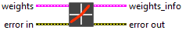
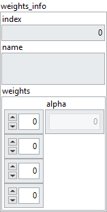

<h1>PReLU 5D</h1>

<h2>Description</h2>

Returns the PReLU5D layer weights. Type : <em><strong>polymorphic</strong><strong>.</strong></em>

<h3>Input parameters</h3>

<table>
  <tbody>
    <tr>
      <td valign="top" width="70%"><table>
  <tbody>
    <tr>
      <td width="64" valign="top"></td>
      <td valign="top"><strong>weights : cluster</strong></td>
    </tr>
    <tr>
      <td></td>
      <td valign="top"><table>
  <tbody>
    <tr>
      <td width="64" valign="top"></td>
      <td valign="top"><strong>index : <em>integer, </em></strong>index of layer.</td>
    </tr>
    <tr>
      <td width="64" valign="top"></td>
      <td valign="top"><strong>name : <em>string, </em></strong>name of layer.</td>
    </tr>
    <tr>
      <td width="64" valign="top"></td>
      <td valign="top"><strong>weight : <em>variant, </em></strong>weight of layer.</td>
    </tr>
  </tbody>
</table></td>
    </tr>
  </tbody>
</table></td>
      <td valign="top" width="30%">

</td>
    </tr>
  </tbody>
</table>

<h3>Output parameters</h3>

<table>
  <tbody>
    <tr>
      <td valign="top" width="70%"><table>
  <tbody>
    <tr>
      <td width="64" valign="top"></td>
      <td valign="top"><strong>weights_info : cluster</strong></td>
    </tr>
    <tr>
      <td></td>
      <td valign="top"><table>
  <tbody>
    <tr>
      <td width="64" valign="top"></td>
      <td valign="top"><strong>index : <em>integer, </em></strong>index of layer.</td>
    </tr>
    <tr>
      <td width="64" valign="top"></td>
      <td valign="top"><strong>name : <em>string, </em></strong>name of layer.</td>
    </tr>
    <tr>
      <td width="64" valign="top"></td>
      <td valign="top"><strong>weights : cluster</strong></td>
    </tr>
    <tr>
      <td></td>
      <td valign="top"><table>
  <tbody>
    <tr>
      <td width="64" valign="top"></td>
      <td valign="top"><strong>alpha : <em>array, </em></strong>4D alpha values. alpha = [input_dim1, input_dim2, input_dim3, input_dim4].</td>
    </tr>
  </tbody>
</table></td>
    </tr>
  </tbody>
</table></td>
    </tr>
  </tbody>
</table></td>
      <td valign="top" width="30%">

</td>
    </tr>
  </tbody>
</table>

<h2>Dimension</h2>

<ul>
<li>alpha = [input_dim1, input_dim2, input_dim3, input_dim4]</li>
</ul>

Its size depends on the input of the <a href="../../../architecture/layers/prelu-add-to-graph/README.md">PReLU</a> layer. 
For example, if the layer has an entry [batch_size = 10, input_dim1 = 7, input_dim2 = 5, input_dim3 = 3, input_dim4 = 2] then alpha will have a size [input_dim1 = 7, input_dim2 = 5, input_dim3 = 3, input_dim4 = 2]. 
The size can also depend on the “shared_axis” parameter that you set to the <a href="../../../architecture/layers/prelu-add-to-graph/README.md">PReLU</a> layer. Each axis specified in this param is represented by a 1 in the weights. 
For example, if you set the parameter with the values [2], alpha will have a size [input_dim1 = 7, 1, input_dim3 = 3, input_dim4 = 2]. 
Another example, if you define the parameter with the values [2, 3], alpha will have a size [input_dim1 = 7, 1, 1, input_dim4 = 2].

<h2>Example</h2>

All these exemples are snippets PNG, you can drop these Snippet onto the block diagram and get the depicted code added to your VI (Do not forget to install Deep Learning library to run it).

