<h1>Resume</h1>

<table>
  <tbody>
    <tr>
      <td valign="top" width="62%">

</td>
      <td valign="top" width="38%">

</td>
    </tr>
  </tbody>
</table>

<h2>FORMAT</h2>

In this section you will find a list for formatting the weights data.

|  | **ICONS** | **RESUME** |
| --- | --- | --- |
| [Dense](https://haibal.com/documentation/dense-format/) | 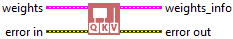 | Returns the Dense layer weights. |
| [AdditiveAttention](https://haibal.com/documentation/additive-attention-format/) |  | Returns the AdditiveAttention layer weights. |
| [Attention](https://haibal.com/documentation/attention-format/) | 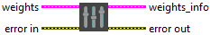 | Returns the Attention layer weights. |
| [MultiHeadAttention](https://haibal.com/documentation/multi-head-attention-format/) | 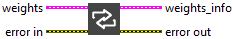 | Returns the MultiHeadAttention layer weights. |
| [BatchNormalization](https://haibal.com/documentation/batch-normalization-format/) | 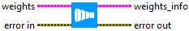 | Returns the BatchNormalization layer weights. |
| [LayerNormalization](https://haibal.com/documentation/layer-normalization-format/) | 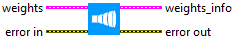 | Returns the LayerNormalization layer weights. |
| [Bidirectional](https://haibal.com/documentation/bidirectional-format/) | 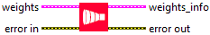 | Returns the Bidirectional layer weights. |
| [GRU](https://haibal.com/documentation/gru-format/) | 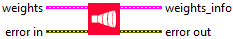 | Returns the GRU layer weights. |
| [LSTM](https://haibal.com/documentation/lstm-format/) | 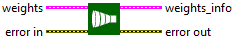 | Returns the LSTM layer weights. |
| [SimpleRNN](https://haibal.com/documentation/simple-rnn-format/) | 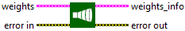 | Returns the SimpleRNN layer weights. |
| [Conv1D](https://haibal.com/documentation/conv-1d-format/) | 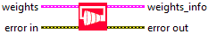 | Returns the Conv1D layer weights. |
| [Conv2D](https://haibal.com/documentation/conv-2d-format/) | 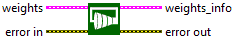 | Returns the Conv2D layer weights. |
| [Conv3D](https://haibal.com/documentation/conv-3d-format/) | 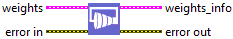 | Returns the Conv3D layer weights. |
| [Conv1DTranspose](https://haibal.com/documentation/conv-1d-transpose-format/) | 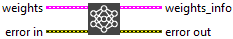 | Returns the Conv1DTranspose layer weights.​ |
| [Conv2DTranspose](https://haibal.com/documentation/conv-2d-transpose-format/) |  | Returns the Conv2DTranspose layer weights.​ |
| [Conv3DTranspose](https://haibal.com/documentation/conv-3d-transpose-format/) |  | Returns the Conv3DTranspose layer weights.​ |
| [ConvLSTM1D](https://haibal.com/documentation/conv-lstm-1d-format/) | 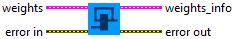 | Returns the ConvLSTM1D layer weights. |
| [ConvLSTM2D](https://haibal.com/documentation/conv-lstm-2d-format/) | 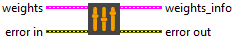 | Returns the ConvLSTM2D layer weights. |
| [ConvLSTM3D](https://haibal.com/documentation/conv-lstm-3d-format/) | 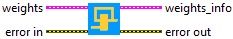 | Returns the ConvLSTM3D layer weights. |
| [DepthwiseConv2D](https://haibal.com/documentation/depthwise-conv-2d-format/) | 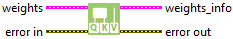 | Returns the DepthwiseConv2D layer weights. |
| [SeparableConv1D](https://haibal.com/documentation/separable-conv-1d-format/) |  | Returns the SeparableConv1D layer weights. |
| [SeparableConv2D](https://haibal.com/documentation/separable-conv-2d-format/) | 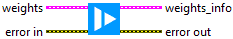 | Returns the SeparableConv2D layer weights. |
| [Embedding](https://haibal.com/documentation/embedding-format/) | 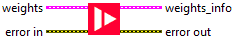 | Returns the Embedding layer weights. |
| [PReLU 2D](https://haibal.com/documentation/prelu-2d-format/) | 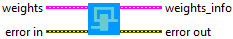 | Returns the PReLU2D layer weights. |
| [PReLU 3D](https://haibal.com/documentation/prelu-3d-format/) |  | Returns the PReLU3D layer weights. |
| [PReLU 4D](https://haibal.com/documentation/prelu-4d-format/) |  | Returns the PReLU4D layer weights. |
| [PReLU 5D](https://haibal.com/documentation/prelu-5d-format/) |  | Returns the PReLU5D layer weights. |
