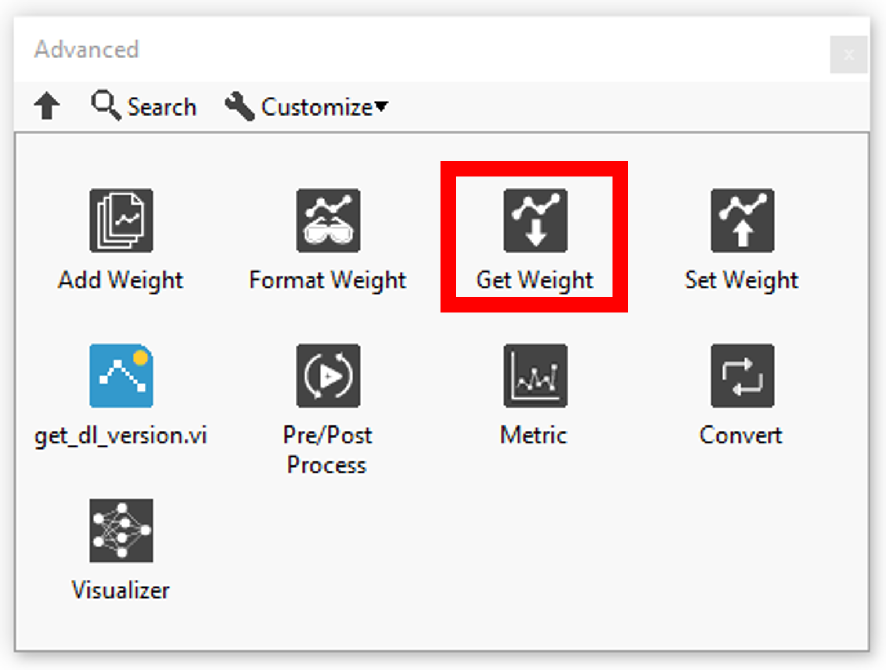
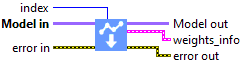

<h1>Resume</h1>

<table>
  <tbody>
    <tr>
      <td valign="top" width="62%">

</td>
      <td valign="top" width="38%">

</td>
    </tr>
  </tbody>
</table>

<h2>GET WEIGHTS</h2>

In this section you will find a list for get type def of the layer weight.

| ### INDEX |  |  |
| --- | --- | --- |
|  | **ICONS** | **RESUME** |
| [Dense](../index/get-dense-weights-by-index/README.md) |  | Gets the weights of the Dense layer selected by the index. |
| [Embedding](../index/get-embedding-weights-by-index/README.md) |  | Gets the weights of the Embedding layer selected by the index. |
| [AdditiveAttention](../index/get-additive-attention-weights-by-index/README.md) |  | Gets the weights of the AdditiveAttention layer selected by the index. |
| [Attention](../index/get-attention-weights-by-index/README.md) |  | Gets the weights of the Attention layer selected by the index. |
| [MultiHeadAttention](../index/get-multi-head-attention-weights-by-index/README.md) |  | Gets the weights of the MultiHeadAttention layer selected by the index. |
| [Conv1D](../index/get-conv-1d-weights-by-index/README.md) |  | Gets the weights of the Conv1D layer selected by the index. |
| [Conv2D](../index/get-conv-2d-weights-by-index/README.md) |  | Gets the weights of the Conv2D layer selected by the index. |
| [Conv3D](../index/get-conv-3d-weights-by-index/README.md) |  | Gets the weights of the Conv3D layer selected by the index. |
| [ConvLSTM1D](../index/get-conv-lstm-1d-weights-by-index/README.md) |  | Gets the weights of the ConvLSTM1D layer selected by the index. |
| [ConvLSTM2D](../index/get-conv-lstm-2d-weights-by-index/README.md) |  | Gets the weights of the ConvLSTM2D layer selected by the index. |
| [ConvLSTM3D](../index/get-conv-lstm-3d-weights-by-index/README.md) |  | Gets the weights of the ConvLSTM3D layer selected by the index. |
| [Conv1DTranspose](../index/get-conv-1d-transpose-weights-by-index/README.md) |  | Gets the weights of the Conv1DTranspose layer selected by the index. |
| [Conv2DTranspose](../index/get-conv-2d-transpose-weights-by-index/README.md) |  | Gets the weights of the Conv2DTranspose layer selected by the index. |
| [Conv3DTranspose](../index/get-conv-3d-transpose-weights-by-index/README.md) |  | Gets the weights of the Conv3DTranspose layer selected by the index. |
| [DepthwiseConv2D](../index/get-depthwise-conv-2d-weights-by-index/README.md) |  | Gets the weights of the DepthwiseConv2D layer selected by the index. |
| [SeparableConv1D](../index/get-separable-conv-1d-weights-by-index/README.md) |  | Gets the weights of the SeparableConv1D layer selected by the index. |
| [SeparableConv2D](../index/get-separable-conv-2d-weights-by-index/README.md) |  | Gets the weights of the SeparableConv2D layer selected by the index. |
| [BatchNormalization](../index/get-batch-norm-weights-by-index/README.md) |  | Gets the weights of the BatchNormalization layer selected by the index. |
| [LayerNormalization](../index/get-layer-norm-weights-by-index/README.md) |  | Gets the weights of the LayerNormalization layer selected by the index. |
| [PReLU 2D](../index/get-prelu-2d-weights-by-index/README.md) |  | Gets the weights of the PReLU2D selected by the index. |
| [PReLU 3D](../index/get-prelu-3d-weights-by-index/README.md) |  | Gets the weights of the PReLU3D selected by the index. |
| [PReLU 4D](../name/get-prelu-4d-weights-by-name/README.md) |  | Gets the weights of the PReLU4D selected by the index. |
| [PReLU 5D](../index/get-prelu-5d-weights-by-index/README.md) |  | Gets the weights of the PReLU5D selected by the index. |
| [Bidirectional](../index/get-bidirectional-weights-by-index/README.md) |  | Gets the weights of the Bidirectional layer selected by the index. |
| [GRU](../index/get-gru-weights-by-index/README.md) |  | Gets the weights of the GRU selected by the index. |
| [LSTM](../index/get-lstm-weights-by-index/README.md) |  | Gets the weights of the LSTM layer selected by the index. |
| [RNN (GRU)](../index/get-rnn-gru-weights-by-index/README.md) |  | Gets the weights of the RNN selected by the index. |
| [RNN (LSTM)](../index/get-rnn-lstm-weights-by-index/README.md) |  | Gets the weights of the RNN selected by the index. |
| [RNN (SimpleRNN)](../index/get-rnn-simple-rnn-weights-by-index/README.md) |  | Gets the weights of the RNN selected by the index. |
| [SimpleRNN](../index/get-simple-rnn-weights-by-index/README.md) |  | Gets the weights of the SimpleRNN selected by the index. |
| ### NAME |  |  |
|  | **ICONS** | **RESUME** |
| [Dense](../name/get-dense-weights-by-name/README.md) |  | Gets the weights of the Dense layer selected by the name. |
| [Embedding](../name/get-embedding-weights-by-name/README.md) |  | Gets the weights of the Embedding layer selected by the name. |
| [AdditiveAttention](../name/get-additive-attention-weights-by-name/README.md) |  | Gets the weights of the AdditiveAttention layer selected by the name. |
| [Attention](../name/get-attention-weights-by-name/README.md) |  | Gets the weights of the Attention layer selected by the name. |
| [MultiHeadAttention](../name/get-multi-head-attention-weights-by-name/README.md) |  | Gets the weights of the MultiHeadAttention layer selected by the name. |
| [Conv1D](../name/get-conv-1d-weights-by-name/README.md) |  | Gets the weights of the Conv1D layer selected by the name. |
| [Conv2D](../name/get-conv-2d-weights-by-name/README.md) |  | Gets the weights of the Conv2D layer selected by the name. |
| [Conv3D](../name/get-conv-3d-weights-by-name/README.md) |  | Gets the weights of the Conv3D layer selected by the name. |
| [ConvLSTM1D](../name/get-conv-lstm-1d-weights-by-name/README.md) |  | Gets the weights of the ConvLSTM1D layer selected by the name. |
| [ConvLSTM2D](../name/get-conv-lstm-2d-weights-by-name/README.md) |  | Gets the weights of the ConvLSTM2D layer selected by the name. |
| [ConvLSTM3D](../name/get-conv-lstm-3d-weights-by-name/README.md) |  | Gets the weights of the ConvLSTM3D layer selected by the name. |
| [Conv1DTranspose](../name/get-conv-1d-transpose-weights-by-name/README.md) |  | Gets the weights of the Conv1DTranspose layer selected by the name. |
| [Conv2DTranspose](../name/get-conv-2d-transpose-weights-by-name/README.md) |  | Gets the weights of the Conv2DTranspose layer selected by the name. |
| [Conv3DTranspose](../name/get-conv-3d-transpose-weights-by-name/README.md) |  | Gets the weights of the Conv3DTranspose layer selected by the name. |
| [DepthwiseConv2D](../name/get-depthwise-conv-2d-weights-by-name/README.md) |  | Gets the weights of the DepthwiseConv2D layer selected by the name. |
| [SeparableConv1D](../name/get-separable-conv-1d-weights-by-name/README.md) |  | Gets the weights of the SeparableConv1D layer selected by the name. |
| [SeparableConv2D](../name/get-separable-conv-2d-weights-by-name/README.md) |  | Gets the weights of the SeparableConv2D layer selected by the name. |
| [BatchNormalization](../name/get-batch-norm-weights-by-name/README.md) |  | Gets the weights of the BatchNormalization layer selected by the name. |
| [LayerNormalization](../name/get-layer-norm-weights-by-name/README.md) |  | Gets the weights of the LayerNormalization layer selected by the name. |
| [PReLU 2D](../name/get-prelu-2d-weights-by-name/README.md) |  | Gets the weights of the PReLU2D selected by the name. |
| [PReLU 3D](../name/get-prelu-3d-weights-by-name/README.md) |  | Gets the weights of the PReLU3D selected by the name. |
| [PReLU 4D](../name/get-prelu-4d-weights-by-name/README.md) |  | Gets the weights of the PReLU4D selected by the name. |
| [PReLU 5D](../name/get-prelu-5d-weights-by-name/README.md) |  | Gets the weights of the PReLU5D selected by the name. |
| [Bidirectional](../name/get-bidirectional-weights-by-name/README.md) |  | Gets the weights of the Bidirectional layer selected by the name. |
| [GRU](../name/get-gru-weights-by-name/README.md) |  | Gets the weights of the GRU selected by the name. |
| [LSTM](../name/get-lstm-weights-by-name/README.md) |  | Gets the weights of the LSTM layer selected by the name. |
| [RNN (GRU)](../name/get-rnn-gru-weights-by-name/README.md) |  | Gets the weights of the RNN selected by the name. |
| [RNN (LSTM)](../index/get-rnn-lstm-weights-by-index/README.md) |  | Gets the weights of the RNN selected by the name. |
| [RNN (SimpleRNN)](../name/get-rnn-simple-rnn-weights-by-name/README.md) |  | Gets the weights of the RNN selected by the name. |
| [SimpleRNN](../name/get-simple-rnn-weights-by-name/README.md) |  | Gets the weights of the SimpleRNN selected by the name. |
