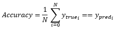

<h1>Accuracy</h1>

<h2>Description</h2>

Calculates how often predictions equal labels. Type : <em><strong>polymorphic</strong><strong>.</strong></em>

<h3>Input parameters</h3>

<table>
  <tbody>
    <tr>
      <td width="64" valign="top"></td>
      <td valign="top"><strong>  y_pred : <em>array, </em></strong>predicted values (numerical label for example, [ 0 ], [ 1 ] and [ 2 ] for 3-class problem).</td>
    </tr>
    <tr>
      <td width="64" valign="top"></td>
      <td valign="top"><strong>y_true : <em>array, </em></strong>true values (numerical label for example, [ 0 ], [ 1 ] and [ 2 ] for 3-class problem).</td>
    </tr>
  </tbody>
</table>

<h3>Output parameters</h3>

<table>
  <tbody>
    <tr>
      <td width="64" valign="top"></td>
      <td valign="top"><strong>accuracy : <em>float, </em></strong>result.</td>
    </tr>
  </tbody>
</table>

<h2>Use cases</h2>

Accuracy is a performance measure commonly used in machine learning, natural language processing (NLP) and computer vision. It is generally used when the output classes of a classification model are equally balanced.

It can be used to evaluate a model in various scenarios, for example :

<ul>
<li>
<ul>
<li>Binary classification : where an output variable can be either 0 or 1. For example, to determine whether an email is spam or not.</li>
<li>Multiclass classification : where an output variable can have more than two possible states. For example, to predict the breed of a dog from an image.</li>
</ul>
</li>
</ul>

<h2>Calculation</h2>

Computes the frequency with which y_pred matches y_true. This frequency is ultimately returned as binary accuracy : an idempotent operation that simply divides total by count.

<h2>Example</h2>

All these exemples are snippets PNG, you can drop these Snippet onto the block diagram and get the depicted code added to your VI (Do not forget to install Deep Learning library to run it).

<h3>Easy to use</h3>

