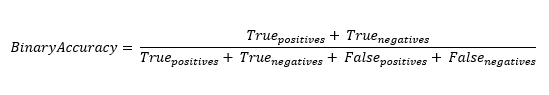

<h1>BinaryAccuracy</h1>

<h2>Description</h2>

Calculates how often predictions match binary labels. Type : <em><strong>polymorphic</strong><strong>.</strong></em>

<h3>Input parameters</h3>

<table>
  <tbody>
    <tr>
      <td width="64" valign="top"></td>
      <td valign="top"><strong>y_pred : <em>array, </em></strong>predicted values.</td>
    </tr>
    <tr>
      <td width="64" valign="top"></td>
      <td valign="top"><strong>y_true : <em>array, </em></strong>true values.</td>
    </tr>
    <tr>
      <td width="64" valign="top"></td>
      <td valign="top"><strong> threshold : <em>float,</em></strong> representing the threshold for deciding whether prediction and true values are 1 or 0 (above the threshold is true, below is false).</td>
    </tr>
  </tbody>
</table>

<h3>Output parameters</h3>

<table>
  <tbody>
    <tr>
      <td width="64" valign="top"></td>
      <td valign="top"><strong>binary_accuracy : <em>float, </em></strong>result.</td>
    </tr>
  </tbody>
</table>

<h2>Use cases</h2>

The binary accuracy metric is specifically used in binary classification, a field of machine learning. Binary classification is a type of classification where an output variable can be either 0 (negative, false, class A) or 1 (positive, true, class B).

For example, in the medical field, binary classification can be used to predict whether or not a patient has a certain disease, based on various characteristics. In informatic field, it can be used to determine whether an e-mail is spam or not.

<h2>Calculation</h2>

The binary accuracy metric is the total number of correct predictions (true positives and true negatives) divided by the total number of predictions (which is the sum of true positives, true negatives, false positives and false negatives).

<h2>Example</h2>

All these exemples are snippets PNG, you can drop these Snippet onto the block diagram and get the depicted code added to your VI (Do not forget to install Deep Learning library to run it).

<h3>Easy to use</h3>

